# Compte rendu Monte Carlo

Ce compte rendu sert à synthétiser le contenu détaillé du cours de `Programmation avancée`
et de `Qualité de développement`.

Dans ce rapport j'ai utilisé ChatGPT afin de reformuler des phrases et de corriger les fautes.

## La méthode de Monte Carlo, c'est quoi ?

La méthode de Monte Carlo c'est une méthode d'approximation de $\pi$ grâce à un grand nombre de simulation
aléatoires. Concrètement, Afin d'approximer $\pi$ on va effectuer des lancers aléatoire sur un quart de disque
(disque de rayon $r = 1$) et pour chacun des lancers on va évaluer sa distance depuis le centre. Pour ça
on utilise la formule suivante :

$d = \sqrt{x^2 + y^2} = x^2 + y^2$

étant donné qu'on a un rayon $r = 1$ il est inutile de faire les puissances et les racines carrées.
Sur $n$ on va approximer $\pi$ en faisant $\frac{nCible}{nTotal}$ avec $nCible$ le nombre de points
avec une distance $d \le 1$.

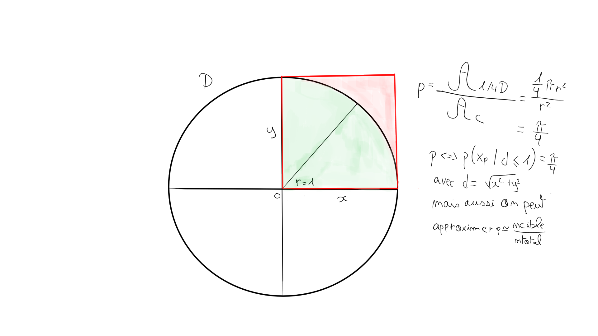

On peut approximer que : 

$p \approx \frac{nCible}{nTotal} = \frac{\pi}4 \approx \frac{nCible}{nTotal}$

$p = \pi \approx 4 \frac{nCible}{nTotal}$

## Implémentation de la méthode de Monte Carlo

Afin d'illustrer une implémentation possible de cette méthode, j'ai
réalisé un pseudo-code en python :

```java
int n_total = 100000;
int n_cible = 0;
for (int i = 0; i <=n_total; i++) {
  double x = Math.random();
  double y = Math.random();
  double d = Math.pow(x, 2) + Math.pow(y, 2);
  if ( d <=1 ) {
    n_cible ++;
  }
}
double pi = 4 * (n_cible / n_total);
```

ici dans ce code, la ressource critique est `n_cible` étant donné qu'elle est
partagée par chaque itération du programme, c'est donc un programme parallèlisable mais
mais il faudrait gérer l'accès à cette ressource (comme par exemple en utilisant un moniteur ou une sémaphore)
dans le cas ou nous faisons des itérations parallèles.

Une autre implémentation de ce programme est possible avec le paradigme Master/Worker.

### Le Master / Worker

Le paradigme Master / Worker c'est :

* Des workers qui ont chacun une tâche attitrée, dans notre cas c'est $n$ lancés aléatoires
* Un master qui attitre des tâches aux workers et qui traite le résultat de leur travail. Dans notre cas, le master
  va s'occuper du calcul `4* (n_cible /n_total)`

Voici un schéma explicatif :
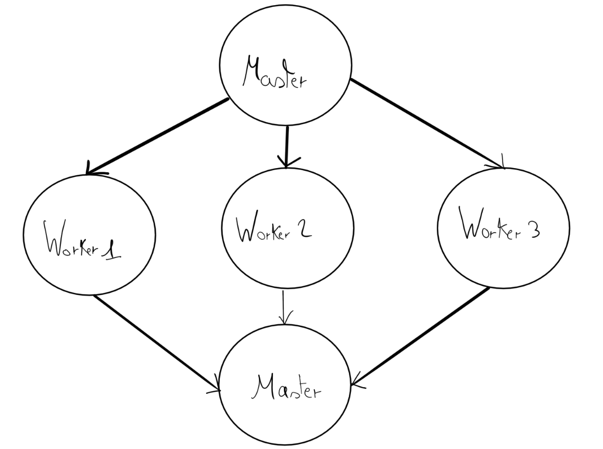

On aura donc $n$ processus worker indépendant, ils vont simultanément calculer $\frac{nTotal}n$
tirage aléatoire chacun. Et une fois que chacun des workers a fini sa tâche individuelle, le master va estimer $pi$.
Afin d'évaluer l'efficacité de la parallélisation d'un programme, il existe une méthode, c'est le speedup.

## Le speedup, c'est quoi ?

Un speedup c'est ça :

$S_p=\frac{T_1}{T_p}$

Un Speedup $S_p$ pour $p$ processus. Dans la formule $T_1$ est le temps d'exécution du programme pour $1$
processus, et $T_p$ est le temps d'exécution pour $p$ processus.

### Ça sert à quoi ?

Comme dit un peu plus haut ça sert à évaluer l'efficacité de la parallélisation d'un programme. Un speedup de $2$
ça veut dire que le programme va deux fois plus vite que si on l'exécutait avec un seul processus.
mais concrètement
il y a deux manières de mesurer un speedup.

#### <u>Scalabilité forte</u>

La scalabilité forte consiste à augmenter le nombre de processus à chaque expérience
tout en gardant la même charge, dans ce cas on espère dans le meilleur des cas une évolution du speedup linéaire
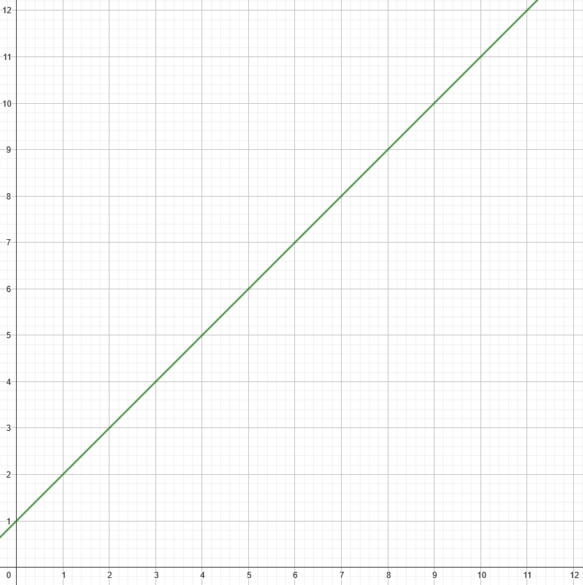

#### <u>Scalabilité faible</u>

La scalabilité faible c'est le fait d'augmenter la charge proportionnellement au nombre de processus. Dans le meilleur
des cas on espère un speedup constant
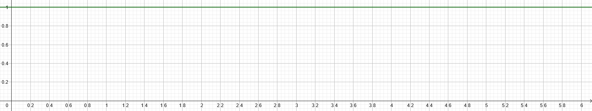

## L'importance de la configuration et l'environnement pour l'évaluation d'un speedup

Il est très important avant d'effectuer des tests sur le programme ciblé car le processeur a un impact majeur sur la
performance du programme, sur un processeur à 8 coeur on peut remarquer une baisse de performance en utilisant
9 processus sur un programme. La fréquence du processeur a aussi un impact sur le temps d'exécution (car cela
influe sur le nombre de cycle). Enfin l'environnement d'exécution a aussi un impact sur les performances du programme
et peut influencer sur le résultat.

Voici ma configuration personnelle sur laquelle j'ai effectué tous les tests :

| Composant  | Détails                               |
|------------|---------------------------------------|
| RAM        | 16 GB                                 |
| Processeur | Intel Core i5-13420H (4.60GHz)        |
| Coeurs     | 8 coeurs physique et 6 coeurs logique |
| Cache L1   | 704 KB                                |
| Cache L2   | 8 MB                                  |
| Cache L3   | 12 MB                                 |

Voici une machine de l'IUT (en G26) sur laquelle j'ai aussi effectué tous les tests :

| Composant  | Détails                       |
|------------|-------------------------------|
| RAM        | 32 GB                         |
| Processeur | Intel Core i7-9700 (3.00 GHz) |
| Coeurs     | 8 coeurs physique             |
| Cache L1   | 512 KB                        |
| Cache L2   | 2 MB                          |
| Cache L3   | 12 MB                         |

## La norme ISO/IEC 9126 et les critères de qualité

Dans le cadre du développement logiciel, plusieurs modèles de qualité ont été définis pour évaluer les systèmes en
fonction de différents critères. Ces critères aident à comprendre à quel point un logiciel est efficace, fiable et bien
conçu. Voici une présentation des deux principaux modèles de qualité : le modèle **Quality In Use** et le modèle *
*Product Quality**.

### Quality In Use Model

Le **Quality In Use Model** évalue la qualité d'un logiciel du point de vue de son utilisateur final. Ce modèle se
concentre sur l'expérience d'utilisation réelle, en tenant compte de plusieurs critères importants. Voici un tableau
récapitulatif des critères de qualité dans ce modèle :

| **Critère**                           | **Définition**                                                                                                                                 |
|---------------------------------------|------------------------------------------------------------------------------------------------------------------------------------------------|
| **Efficiency**                        | La capacité du système à permettre à l'utilisateur d'accomplir ses tâches avec les resources appropriées à celles-ci                           |
| **Effectiveness**                     | La capacité du système à permettre à l'utilisateur d'atteindre ses objectifs de manière correcte et complète.                                  |
| **Usefulness**                        | Mesure dans laquelle le logiciel remplit ses fonctions de manière utile (ex. StarUML est plus utile pour créer des diagrammes que Excalidraw). |
| **Trust**                             | La confiance de l'utilisateur dans la stabilité et la fiabilité du logiciel (ex. absence de crashs inattendus).                                |
| **Pleasure**                          | L'agrément de l'utilisateur lorsqu'il utilise le logiciel, notamment pour les débutants.                                                       |
| **Comfort**                           | Le confort de l'utilisateur, notamment en termes de modularité et d'ergonomie de l'application.                                                |
| **Economic risk**                     | Le coût lié à la maintenance du logiciel, incluant les mises à jour et les éventuels problèmes financiers associés.                            |
| **Health and safety risk mitigation** | La réduction des risques pour la santé et la sécurité des utilisateurs (ex. IA qui donne de mauvais conseils).                                 |
| **Environmental risk mitigation**     | La réduction des risques pour l'environnement, comme un bras robotique qui pourrait endommager des personnes.                                  |
| **Context completeness**              | La capacité du logiciel à remplir son rôle de manière adéquate dans le contexte spécifique de l'application.                                   |
| **Flexibility**                       | La capacité du logiciel à s'adapter à différents contextes ou besoins sans nécessiter une refonte importante.                                  |

### Product Quality Model

Le **Product Quality Model** se concentre sur les critères qui déterminent la qualité intrinsèque d'un produit logiciel,
en particulier sa capacité à répondre aux besoins fonctionnels et de performance. Ce modèle comprend plusieurs
sous-critères qui influent sur la qualité du produit à différents niveaux.

#### 1. **Functional Suitability**

La **Functional Suitability** est la mesure dans laquelle un produit ou un système répond aux besoins fonctionnels
spécifiés.

| **Critère**                    | **Définition**                                                                                     |
|--------------------------------|----------------------------------------------------------------------------------------------------|
| **Functional completeness**    | Le degré auquel toutes les fonctionnalités attendues ont été implémentées et sont opérationnelles. |
| **Functional correctness**     | L'exactitude des fonctionnalités, c'est-à-dire si elles fonctionnent comme prévu sans erreurs.     |
| **Functional appropriateness** | La pertinence des fonctionnalités par rapport aux besoins et au contexte de l'utilisateur.         |

#### 2. **Performance Efficiency**

La **Performance Efficiency** évalue la performance d'un système en fonction des ressources utilisées (temps, mémoire,
etc.).

| **Critère**              | **Définition**                                                                                                                   |
|--------------------------|----------------------------------------------------------------------------------------------------------------------------------|
| **Time behaviour**       | Le temps nécessaire à l'exécution d'une tâche, une performance optimale étant souhaitée.                                         |
| **Resource utilization** | L'utilisation optimale des ressources, garantissant que le système fonctionne efficacement sans dépasser les limites spécifiées. |
| **Capacity**             | La capacité du système à supporter des charges de travail importantes sans dégradation de performance.                           |

#### 3. **Maintainability**

La **Maintainability** se réfère à la facilité avec laquelle un système peut être modifié, corrigé ou mis à jour sans
causer de nouveaux problèmes.

| **Critère**       | **Définition**                                                                                                                          |
|-------------------|-----------------------------------------------------------------------------------------------------------------------------------------|
| **Modularity**    | La division du système en modules indépendants, permettant une gestion plus facile des modifications sans affecter le reste du système. |
| **Reusability**   | La capacité à réutiliser des composants ou du code dans différents projets ou systèmes sans modifications importantes.                  |
| **Analysability** | La facilité avec laquelle on peut analyser un système pour en comprendre les erreurs ou pour l'améliorer.                               |
| **Modifiability** | La capacité à modifier le système sans affecter négativement d'autres parties du système, tout en restant fonctionnel.                  |
| **Testability**   | Le degré de facilité avec lequel le système peut être testé pour s'assurer de sa fiabilité et de sa conformité aux attentes.            |

## Analyse des mesures d'efficacité grâce à la norme ISO/IEC 25022

le calcul de la scalabilité est un critère de **Quality in use**, plus précisément c'est un critère de **Effeciency**.
Car il sert à mesurer le speedup en fonction du temps d'exécution, en d'autres termes on mesure à quel point le
programme
va plus vite en fonction du nombre de processus.
(pour un $S_p = 2$ on va deux fois **plus vite** que l'exécution à un seul processus
tandis que $S_p$ = 0.5 on va deux fois **moins vite** que l'exécution à un seul processus)

la methode de Monte Carlo dans son essence même est une méthode probabiliste.
C'est à dire que grâce à des lois de probabilité, on approxime $\pi$. Cela implique que
le controle de l'erreur est très compliqué (car aléatoire). Cela étant dit,
il est possible de réaliser les mesures d'efficacité d'un programme
à la page 14 du document, cette formule nous est énoncée :

$X = \frac{T_t}{T_a}$

Dans le cas d'un speedup, on peut considérer que $T_t = T_1$ et $T_a = T_p$,
on peut donc considérer que

$X = \frac{T_t}{T_a} \approx S_p$

Partons du principe qu'on a un temps d'exécution voulu $\hat{T_p}$ pour $T_p$, l'erreur se calcul (en %) avec :

$X = \frac{\hat{T_p}}{T_p}$

## Evaluation des critères de qualité ainsi que la scalabilité des différentes implémentations de la méthode de Monte Carlo

## Pi.java

Pi.java implémente la méthode de Monte Carlo avec un modèle Master/Worker en mémoire partagée.
* Le Master distribue les tâches à N Workers via un FixedThreadPool.
* Chaque Worker effectue une simulation et renvoie son résultat au Master, qui agrège les données.

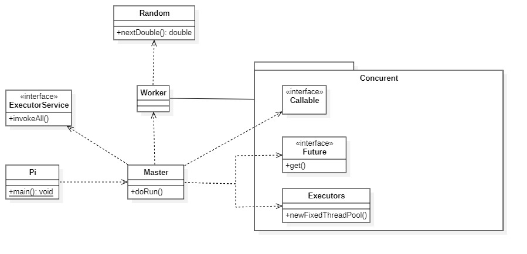

### Évaluation des scalabilités

#### <u>Evaluation de la scalabilité forte de Pi.java sur ma machine :</u>

Données d'études de scalabilité forte avec pi.java

| Erreur                | Ntotal    | Nprocessus | Temps (ms) |
|-----------------------|-----------|------------|------------|
| 2.652998634675312E-5  | 100000000 | 1          | 3445       |
| 7.803252593125184E-5  | 100000000 | 2          | 1673       |
| 1.257367308080578E-4  | 100000000 | 4          | 1074       |
| 2.8066525331449137E-5 | 100000000 | 8          | 630        |
| 8.770506560683454E-5  | 100000000 | 16         | 433        |

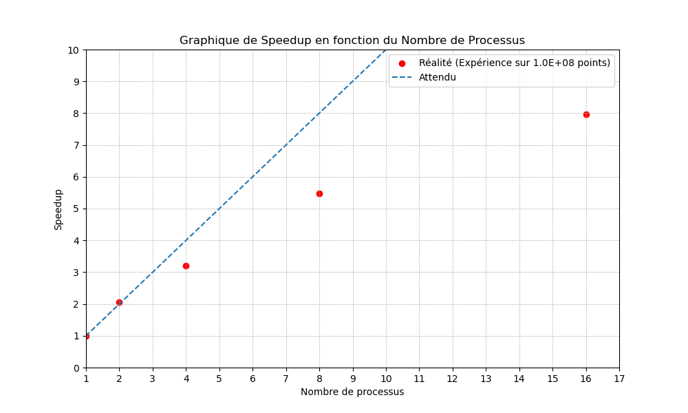

Analyse du graphique :
* Référence théorique (courbe attendue) :
    * La courbe en pointillés représente le speedup idéal linéaire (speedup = nombre de processus).
    * Si l’implémentation était parfaitement scalable, les points expérimentaux seraient alignés sur cette droite.

* Résultats expérimentaux :
    * Pour 2, 4 et 8 processus, le speedup suit une tendance quasi-linéaire mais reste légèrement en dessous.
    * À 16 processus, le speedup est clairement sous la ligne idéale, indiquant une dégradation des performances.

#### <u>Evaluation de la scalabilité forte de Pi.java sur la machine de l'IUT :</u>

| Erreur                | Ntotal    | Nprocessus | Temps (ms) |
|-----------------------|-----------|------------|------------|
| 7.844861411660524E-5  | 100000000 | 1          | 3156       |
| 3.164840931658016E-5  | 100000000 | 2          | 1610       |
| 7.804117746236309E-5  | 100000000 | 4          | 829        |
| 1.0963025056722495E-4 | 100000000 | 8          | 453        |
| 8.967932160437934E-6  | 100000000 | 16         | 500        |

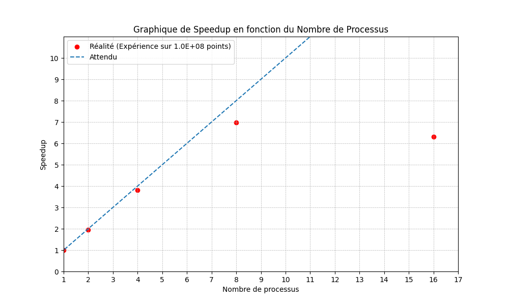

* Résultats expérimentaux :
  * Résultat comparable concernant les experiences à 2, 4 et 8 processus
  * En raison de l'architecture (8 coeurs physique, 0 coeur logique) on remarque une nette baisse de performance
comparé aux experience sur mon PC à 16 coeurs

| Machine     | Valeur de $S_p$ à $p = 16$ |
|-------------|----------------------------|
| Ma machine  | 7.77                       |
| PC de l'IUT | 6.31                       |

#### <u>Evaluation de la scalabilité faible de Pi.java sur ma machine :</u>

| Erreur                | Ntotal    | Nprocessus | Temps (ms) |
|-----------------------|-----------|------------|------------|
| 1.9574352184204526E-4 | 10000000  | 1          | 332        |
| 3.993646404928803E-6  | 20000000  | 2          | 328        |
| 5.555650180506118E-6  | 30000000  | 3          | 333        |
| 1.5996214447351963E-5 | 40000000  | 4          | 334        |
| 4.0009512261139814E-5 | 50000000  | 5          | 349        |
| 6.967158625431769E-5  | 60000000  | 6          | 349        |
| 5.988886241878413E-5  | 70000000  | 7          | 355        |
| 2.1216496580845564E-5 | 80000000  | 8          | 359        |
| 2.3460064333349932E-5 | 90000000  | 9          | 415        |
| 9.379449679221532E-6  | 100000000 | 10         | 430        |
| 6.722674376552224E-5  | 110000000 | 11         | 469        |
| 3.382156807373275E-5  | 120000000 | 12         | 475        |
| 5.75970312383363E-5   | 130000000 | 13         | 574        |
| 7.022029186756727E-5  | 140000000 | 14         | 620        |
| 9.748852414555198E-6  | 150000000 | 15         | 626        |
| 3.89815343908859E-6   | 160000000 | 16         | 654        |

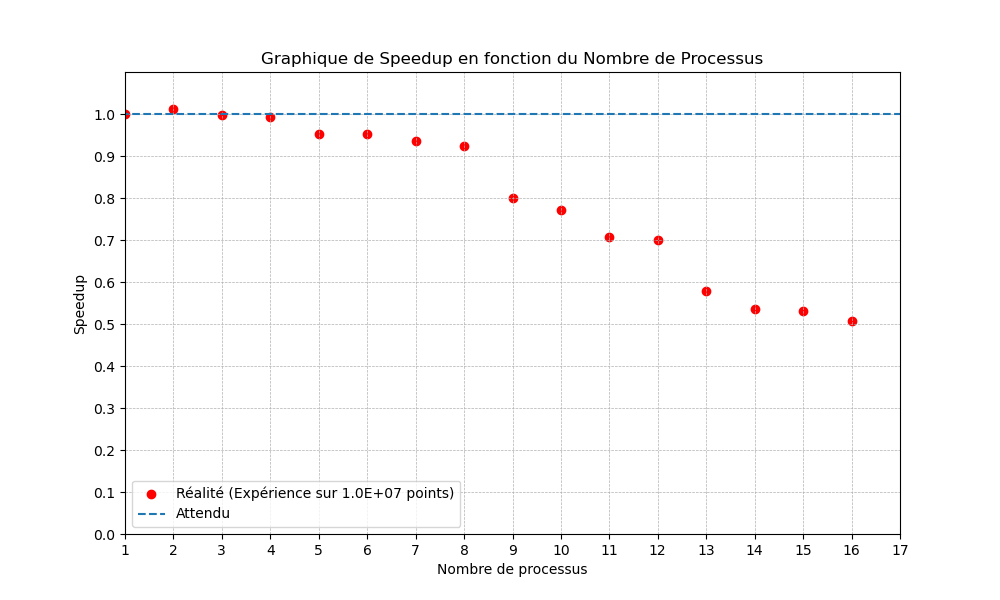

* Référence théorique (courbe attendue) :
  * La courbe en pointillés représente le speedup idéal linéaire (speedup = 1).
  * Si l’implémentation était parfaitement scalable, les points expérimentaux seraient alignés sur cette droite.

* Résultats expérimentaux :
  * Pour 2, 4 et 8 processus, le temps d’exécution reste relativement stable, le programme tien bien la charge jusqu'à 8 processus
  * À partir de 9 processus, le temps d’exécution augmente de manière plus marquée, indiquant une dégradation des performances surement due aux temps .
  * Avec 16 processus, le temps d’exécution double quasiment par rapport à 1 seul processus.

#### <u>Evaluation de la scalabilité faible de Pi.java sur la machine de l'IUT :</u>

| Erreur                | Ntotal    | Nprocessus | Temps (ms) |
|-----------------------|-----------|------------|------------|
| 9.999590807803488E-5  | 10000000  | 1          | 321        |
| 1.3969143621836067E-4 | 20000000  | 2          | 326        |
| 3.985656024836787E-5  | 30000000  | 3          | 329        |
| 6.158153630970143E-6  | 40000000  | 4          | 330        |
| 5.594181983020367E-5  | 50000000  | 5          | 345        |
| 5.950689055542328E-5  | 60000000  | 6          | 345        |
| 7.158221514336294E-5  | 70000000  | 7          | 360        |
| 8.25070651655211E-5   | 80000000  | 8          | 362        |
| 1.3150733536701468E-4 | 90000000  | 9          | 472        |
| 4.9906664388084404E-5 | 100000000 | 10         | 520        |
| 5.488789508659971E-5  | 110000000 | 11         | 568        |
| 6.369797072353024E-5  | 120000000 | 12         | 627        |
| 1.0580857310292882E-4 | 130000000 | 13         | 665        |
| 6.057778764957703E-5  | 140000000 | 14         | 722        |
| 1.7529080735863494E-6 | 150000000 | 15         | 800        |
| 5.88327673805791E-5   | 160000000 | 16         | 816        |

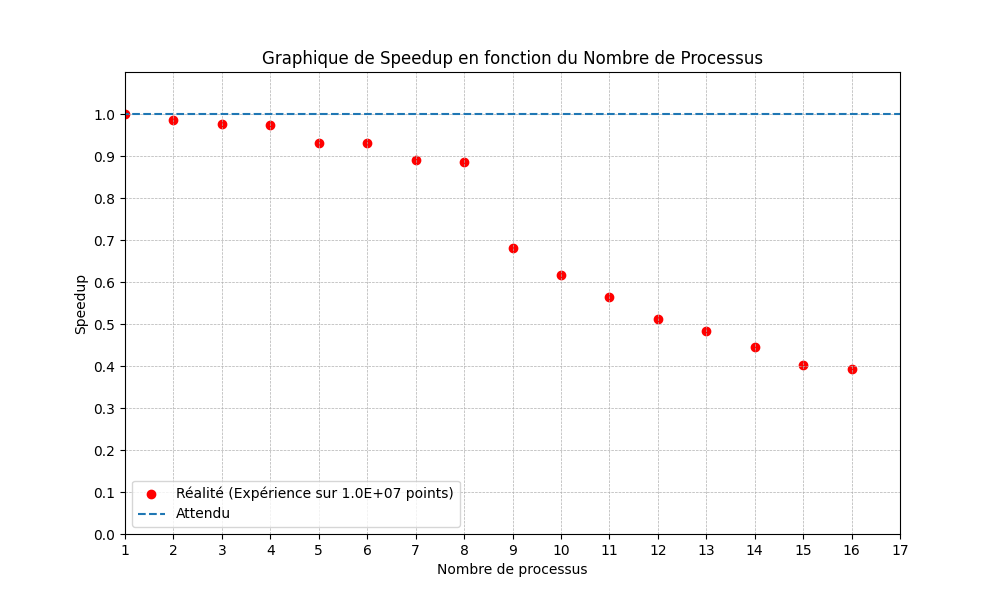

* Résultats expérimentaux :
  * Les performances sont globalement similaires à celles de ma machine pour les petites valeurs de pp (2, 4, 8 processus).
  * La dégradation du temps d’exécution devient plus marquée à partir de 9 processus, et encore plus forte à 16 processus.
  * Comparé à mon PC, les performances sont moins bonnes sur la machine de l’IUT, surement dû à la fréquence du CPU qui est moins elevée

| Machine     | Valeur de $S_p$ à $p = 16$ |
|-------------|----------------------------|
| Ma machine  | 0,50                       |
| PC de l'IUT | 0,39                       |

## Assignment102

* PiMonteCarlo : Gère le calcul de Pi avec un compteur atomique nAtomSuccess pour compter les succès des simulations (points dans le cercle).
* MonteCarlo : Chaque Worker génère deux nombres aléatoires et vérifie s'ils sont dans le cercle unité. Si oui, incrémente le compteur atomique.
* getPi : Crée un ExecutorService avec des threads, distribue les tâches de simulation, attend que tous les threads terminent, puis calcule Pi en fonction du nombre de succès.
* Main : Lance plusieurs tests avec différents nombres de threads, mesure le temps, trie les résultats et calcule l'erreur par rapport à Pi exact. Sauvegarde dans un fichier CSV.

Master/Worker : Le Master distribue les tâches aux Workers via un pool de threads. La mémoire partagée est sécurisée avec AtomicInteger.

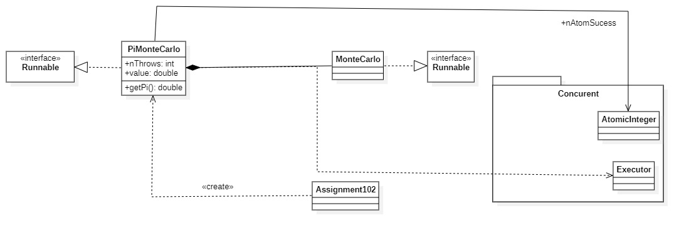

### Évaluation des scalabilités

#### <u>Evaluation de la scalabilité forte de Assignment102 sur ma machine :</u>

| Erreur                | Ntotal   | Nprocessus | Temps (ms) |
|-----------------------|----------|------------|------------|
| 3.421660694865587E-4  | 10000000 | 1          | 845        |
| 8.576974149886625E-5  | 10000000 | 2          | 812        |
| 1.09324673076508E-4   | 10000000 | 3          | 760        |
| 1.319883369727388E-4  | 10000000 | 4          | 747        |
| 1.0244917953488176E-4 | 10000000 | 5          | 696        |
| 2.7582694304421727E-5 | 10000000 | 6          | 745        |
| 1.5796242368537624E-4 | 10000000 | 7          | 723        |
| 7.838495213933131E-5  | 10000000 | 8          | 734        |
| 4.056973766081112E-5  | 10000000 | 9          | 781        |
| 1.4281087310294552E-4 | 10000000 | 10         | 821        |
| 1.3411872787692897E-4 | 10000000 | 11         | 804        |
| 4.63026617738537E-6   | 10000000 | 12         | 840        |
| 6.361537342040279E-5  | 10000000 | 13         | 771        |
| 3.55696524982708E-4   | 10000000 | 14         | 823        |
| 1.0903256268406217E-5 | 10000000 | 15         | 929        |
| 2.4212355759231684E-4 | 10000000 | 16         | 813        |

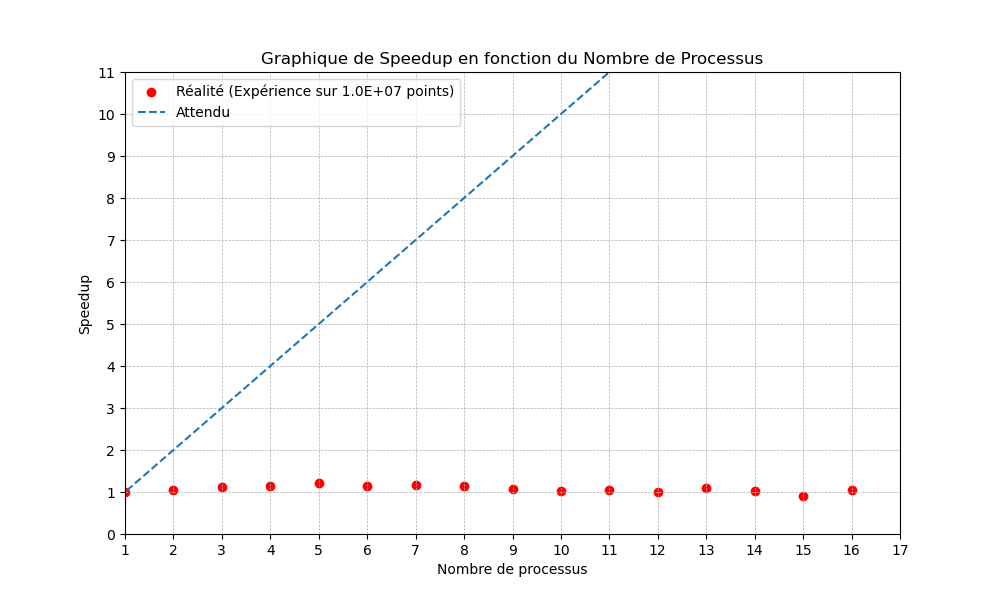

#### <u>Evaluation de la scalabilité forte de Assignment102 sur la machine de l'IUT :</u>

| Erreur                | Ntotal   | Nprocessus | Temps (ms) |
|-----------------------|----------|------------|------------|
| 1.3835453469645634E-4 | 10000000 | 1          | 1034       |
| 3.407621598254574E-5  | 10000000 | 2          | 2096       |
| 3.0884130973652025E-4 | 10000000 | 3          | 2935       |
| 8.360523427282492E-5  | 10000000 | 4          | 2935       |
| 4.6748695701041864E-4 | 10000000 | 5          | 3322       |
| 1.3666520696633115E-4 | 10000000 | 6          | 3494       |
| 1.6926013931164047E-4 | 10000000 | 7          | 3851       |
| 9.048072781445114E-5  | 10000000 | 8          | 3839       |
| 8.815478031201076E-5  | 10000000 | 9          | 4009       |
| 1.5872636741223932E-4 | 10000000 | 10         | 3824       |
| 2.160221469252729E-4  | 10000000 | 11         | 4130       |
| 3.127508898418919E-5  | 10000000 | 12         | 4131       |
| 1.2266357284234394E-6 | 10000000 | 13         | 4347       |
| 8.21705544516541E-5   | 10000000 | 14         | 4457       |
| 1.695147872205948E-4  | 10000000 | 15         | 4425       |
| 9.633762972011859E-5  | 10000000 | 16         | 4023       |

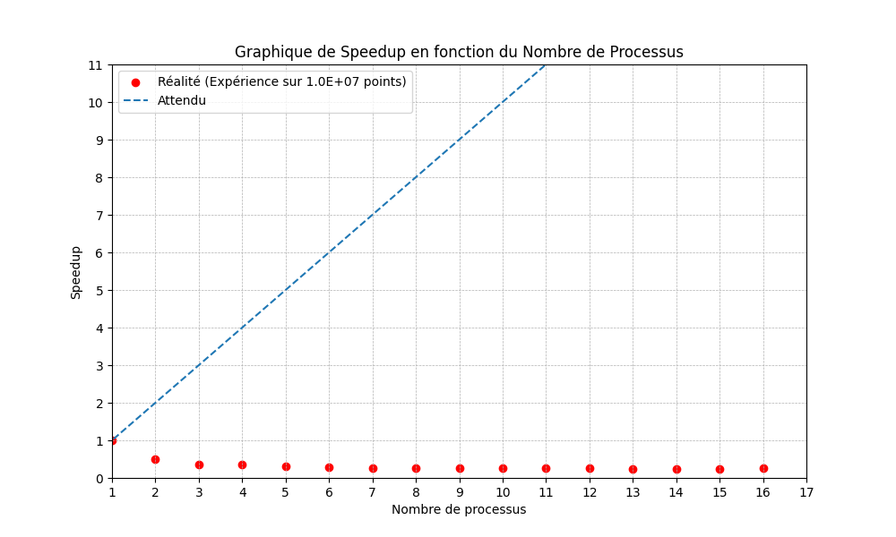

| Machine     | Valeur de $S_p$ à $p = 16$ |
|-------------|----------------------------|
| Ma machine  | 1,03                       |
| PC de l'IUT | 0,25                       |

#### <u>Evaluation de la scalabilité faible de Assignment102 sur ma machine :</u>

| Erreur                | Ntotal    | Nprocessus | Temps (ms) |
|-----------------------|-----------|------------|------------|
| 1.3160971127002872E-5 | 10000000  | 1          | 843        |
| 1.8724693321427893E-4 | 20000000  | 2          | 1333       |
| 1.0881537725859929E-4 | 30000000  | 3          | 2134       |
| 9.907280940805767E-5  | 40000000  | 4          | 3016       |
| 1.4621115739054989E-5 | 50000000  | 5          | 3766       |
| 4.037875172898934E-5  | 60000000  | 6          | 4747       |
| 6.137702543789971E-6  | 70000000  | 7          | 5238       |
| 2.7691817431330862E-5 | 80000000  | 8          | 6226       |
| 1.2134054495042494E-5 | 90000000  | 9          | 6875       |
| 3.7072409777124166E-5 | 100000000 | 10         | 7983       |
| 5.677521298670445E-5  | 110000000 | 11         | 8789       |
| 2.5400312580458155E-6 | 120000000 | 12         | 9767       |
| 3.5672662488709846E-5 | 130000000 | 13         | 10833      |
| 1.7086478417457924E-6 | 140000000 | 14         | 11827      |
| 3.9406845543191645E-5 | 150000000 | 15         | 13135      |
| 2.311839815068496E-5  | 160000000 | 16         | 16641      |

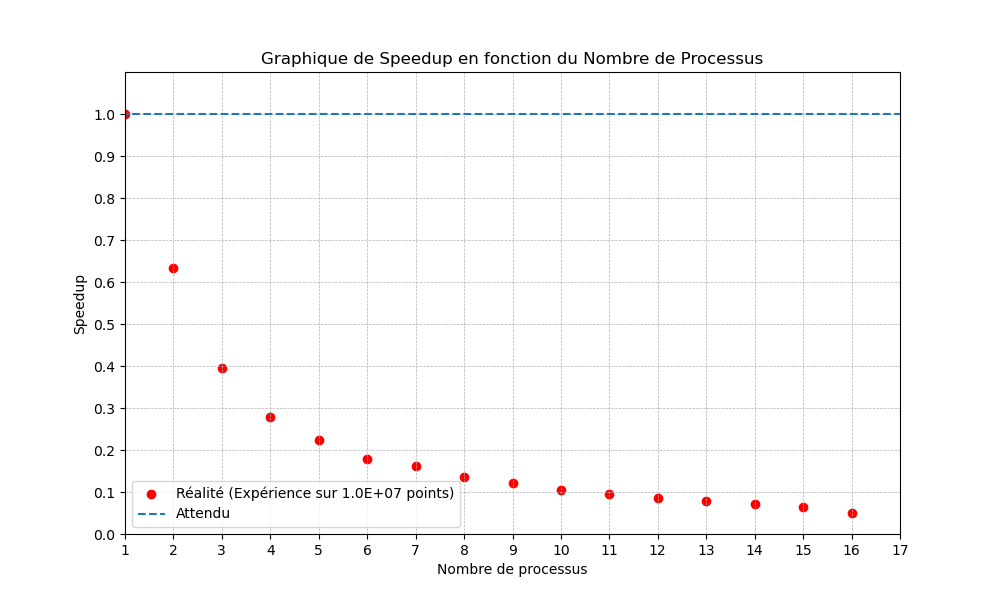

#### <u>Evaluation de la scalabilité faible de Assignment102 sur la machine de l'IUT :</u>

| Erreur                | Ntotal    | Nprocessus | Temps (ms) |
|-----------------------|-----------|------------|------------|
| 1.0993117740169408E-6 | 10000000  | 1          | 964        |
| 5.012238040746224E-6  | 20000000  | 2          | 4348       |
| 2.138626185338756E-5  | 30000000  | 3          | 7918       |
| 1.1189735166068215E-5 | 40000000  | 4          | 12546      |
| 2.2485735251743418E-7 | 50000000  | 5          | 17499      |
| 9.295465013335847E-7  | 60000000  | 6          | 21170      |
| 1.2143863788783024E-4 | 70000000  | 7          | 24589      |
| 4.265466741522471E-5  | 80000000  | 8          | 29124      |
| 1.2849734793962089E-5 | 90000000  | 9          | 37074      |
| 4.4656836599309415E-5 | 100000000 | 10         | 41255      |
| 8.166125863374539E-5  | 110000000 | 11         | 41147      |
| 1.485806070391984E-4  | 120000000 | 12         | 46665      |
| 2.5614070085366214E-5 | 130000000 | 13         | 44727      |
| 1.0801731720988503E-4 | 140000000 | 14         | 55690      |
| 5.3802940662386415E-5 | 150000000 | 15         | 59059      |
| 3.4848117456656396E-5 | 160000000 | 16         | 64518      |

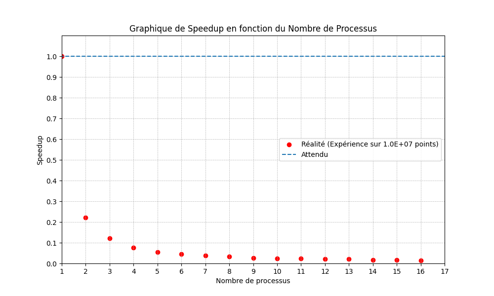

| Machine     | Valeur de $S_p$ à $p = 16$ |
|-------------|----------------------------|
| Ma machine  | 0,05                       |
| PC de l'IUT | 0,01                       |

## Comparaison d'Assignment102 avec une implémentation légèrement "améliorée"

```java
int n_total = 100000;
int n_cible = n_total;
for(int i = 0; i <= n_total; i++) {
  double x = Math.random();
  double y = Math.random();
  double d = Math.pow(x, 2) + Math.pow(y, 2);
  if(d <=1) {
    n_cible --;
  }
}
double pi = 4 * (n_cible / n_total);
```
J'ai créé une version "améliorée" de `assignment102` que j'ai appelé `assignment103`, cette implémentation est censé mieux se parallèliser que la version initiale de `assignment102`.

Voici les resultats obtenu sur ma machine concernant sur une scalabilité faible avec `assignment102` : 
| Erreur                | Ntotal    | Nprocessus | Temps(ms) |
|----------------------|-----------|------------|-----------|
| 6.0559598513091885E-5 | 10000000  | 1          | 636       |
| 3.0383821302919632E-5 | 20000000  | 2          | 1287      |
| 8.83586619065453E-5   | 30000000  | 3          | 2046      |
| 7.784382533285632E-5  | 40000000  | 4          | 2801      |
| 6.387002132935714E-5  | 50000000  | 5          | 3469      |
| 5.746636112186545E-6  | 60000000  | 6          | 4244      |
| 5.794370903953075E-6  | 70000000  | 7          | 5076      |
| 8.411224475744872E-5  | 80000000  | 8          | 5830      |
| 2.1994587413659557E-5 | 90000000  | 9          | 6732      |
| 2.497663410214569E-5  | 100000000 | 10         | 7394      |
| 1.643332306673832E-6  | 110000000 | 11         | 8272      |
| 8.643819225988911E-5  | 120000000 | 12         | 8932      |
| 4.5858578846601335E-5 | 130000000 | 13         | 9739      |
| 6.790117698253307E-5  | 140000000 | 14         | 10458     |
| 2.668293835952506E-5  | 150000000 | 15         | 11886     |
| 5.5593964288694E-5    | 160000000 | 16         | 12738     |


Et voici `assignment103` avec aussi un speedup avec scalabilité faible :
| Erreur                | Ntotal    | Nprocessus | Temps(ms) |
|----------------------|-----------|------------|-----------|
| 1.2902576969798323E-4 | 10000000  | 1          | 588       |
| 1.1482914877409597E-4 | 20000000  | 2          | 1344      |
| 4.434701497684959E-5  | 30000000  | 3          | 2003      |
| 3.060435288988145E-5  | 40000000  | 4          | 2656      |
| 3.730159289519722E-5  | 50000000  | 5          | 3335      |
| 1.589843614822685E-5  | 60000000  | 6          | 4204      |
| 2.3999434442858324E-5 | 70000000  | 7          | 4939      |
| 5.465495012436297E-5  | 80000000  | 8          | 5553      |
| 4.3096247534454416E-5 | 90000000  | 9          | 6458      |
| 1.9446693613676406E-5 | 100000000 | 10         | 7204      |
| 5.90664357742553E-5   | 110000000 | 11         | 7941      |
| 6.621490415765105E-5  | 120000000 | 12         | 8620      |
| 1.799928139699426E-5  | 130000000 | 13         | 9574      |
| 1.9790911327917317E-5 | 140000000 | 14         | 10355     |
| 1.5834937438437065E-5 | 150000000 | 15         | 11169     |
| 2.3452623531267063E-5 | 160000000 | 16         | 12198     |

On remarque que `assignment103` se parallèlise légèrement mieux que `assignment102` car le temps médian plus court. Néanmoins si le Speedup reste sensiblement le même.

Speedup scalabilité faible de `assignment103` :

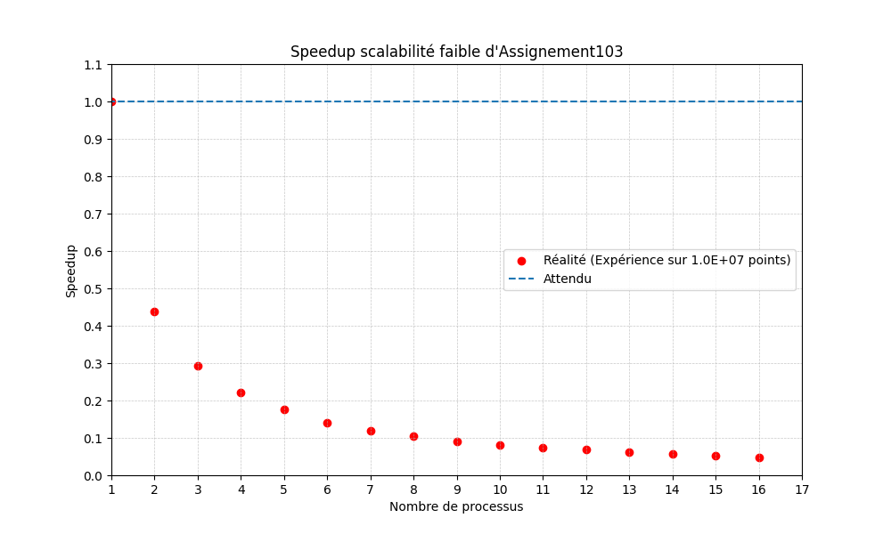

Speedup scalabilité faible de `assignment102` :

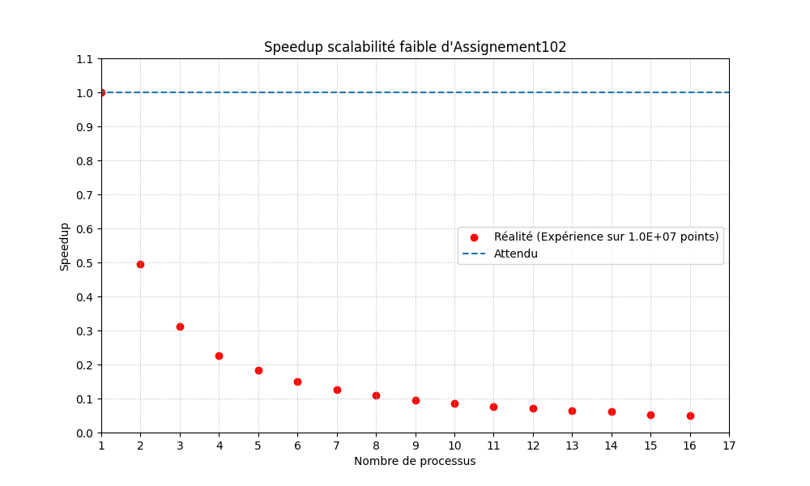

### Pourquoi assignment103 est plus rapide ? 

Un point généré aléatoirement a une probabilité de :  

$p_{\text{cercle}} = \frac{\pi}{4} \approx 0.785$ 

de tomber à l'intérieur du cercle, et donc une probabilité de :  

$\overline{p_{\text{cercle}}} = 1 - \frac{\pi}{4} \approx 0.215$  

de tomber à l'extérieur.

Dans `assignment102`, on **incrémente** `n_cible` chaque fois qu’un point tombe **dans** le cercle.  

Dans `assignment103`, au lieu d’incrémenter, on **décrémente** `n_cible` lorsqu’un point tombe **dans** le cercle.  

Cela signifie que :  
- On modifie `n_cible` **moins souvent** dans `assignment103` car $( 1 - \frac{\pi}{4})$ est **inférieur** à $(\frac{\pi}{4})$.  
- Moins d’accès concurrents = moins de contention entre les threads.  
- Moins de contention = un **meilleur temps d'exécution**

Grâce à cette inversion de logique, `assignment103` **accède à la ressource critique moins souvent** que `assignment102`, ce qui réduit le **goulot d’étranglement** et améliore la parallélisation. C'est pourquoi `assignment103` est plus rapide !

## Evaluation du critère de product quality model : Functional correctness 

On remarque sur ce graphique, la tendance de l'erreur sur l'apporximation de $\pi$ grâce à la méthode de monte carlo

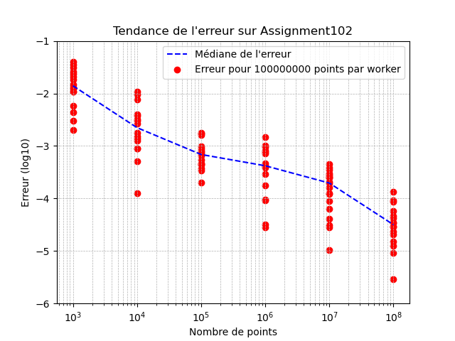

La dispersion des points rouges montre que l'erreur varie selon les expériences, ce qui est dû à la nature aléatoire de la méthode.

Ce graphique confirme que l'approximation de $\pi$ avec monte carlo s'améliore avec le nombre de points, mais avec une convergence relativement lente. Pour obtenir une bonne précision, il faut un très grand nombre de points. Ce qui en fait une méthode intéressante à parallèliser mais pas une bonne méthode pour approximer $\pi$.

## Mise en oeuvre de la méthode de monte carlo en mémoire distribuée

C'est concrètement la même implémentation que `Pi.java` mais en mémoire distribuée. C'est à dire : 
* Un master qui stocke les adresses/ports des workers
* Des workers qui se voient attribuer une tâche via un message du master depuis le réseau
* Les workers renvoient leurs calcul au master, qui se charge ensuite d'approximer $\pi$.

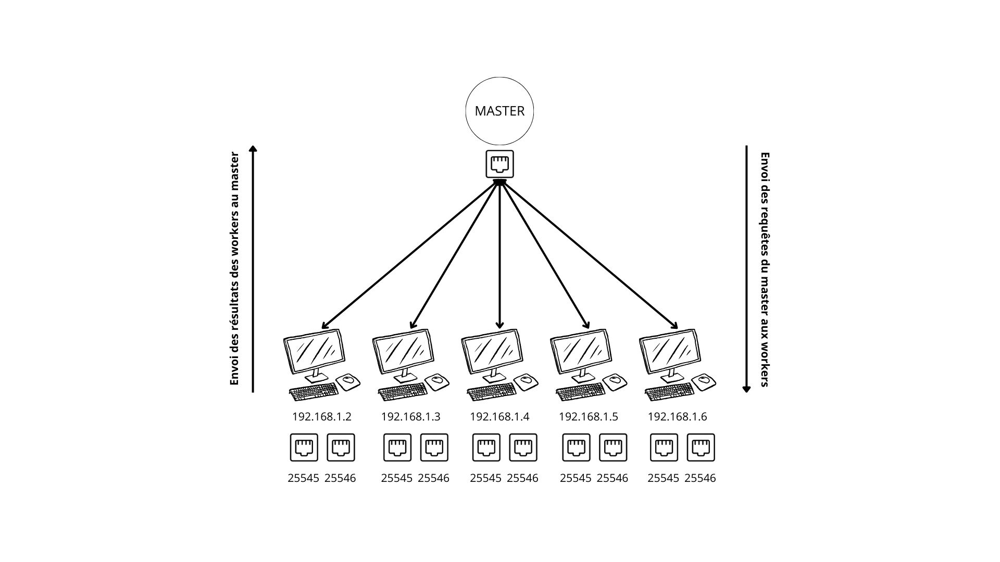

MasterSocket.java :

* Le Master distribue des tâches aux Workers via des sockets pour calculer Pi avec Monte Carlo.
* Il envoie le nombre de simulations à chaque Worker, récupère les résultats, calcule Pi et mesure le temps.
* Les résultats sont enregistrés dans un fichier CSV.

WorkerSocket.java :

* Le Worker effectue les simulations de Monte Carlo pour Pi, renvoie les résultats au Master et termine sur "END".

Communication : Le Master envoie les tâches, le Worker renvoie les résultats. Le Master calcule Pi et affiche l’erreur.


### Pourquoi c'est plus puissant que Pi.java ?

`Pi.java` est limité aux ressources de la machine sur laquelle il tourne. En revanche, une exécution distribuée via des sockets permet d'exploiter la puissance de plusieurs machines simultanément, rendant possible des calculs bien plus lourds.

Cependant, la communication interprocessus en local est beaucoup plus rapide qu'un échange réseau. Résultat : pour de petits calculs, Pi.java sera plus rapide, car le coût des transmissions réseau devient significatif.

### Une expérience sur un seul poste

sur un poste en G26, voici une expérience sur scalabilité faible : 
| Erreur             | Ntotal    | Nprocessus | Temps(ms) |
|--------------------|----------|------------|-----------|
| 1.130170677561341E-4 | 10000000  | 1          | 313       |
| 1.3068098110611585E-4 | 20000000  | 2          | 314       |
| 1.0623478184706319E-4 | 30000000  | 3          | 317       |
| 7.882830064682255E-5  | 40000000  | 4          | 314       |
| 1.760049627372199E-5  | 50000000  | 5          | 330       |
| 4.6617625498158996E-5 | 60000000  | 6          | 340       |
| 2.8454688638684975E-6 | 70000000  | 7          | 345       |
| 1.1680495540174178E-4 | 80000000  | 8          | 356       |
| 3.477774917551441E-5  | 90000000  | 9          | 486       |
| 4.368052301442607E-5  | 100000000 | 10         | 506       |
| 8.302709741817549E-5  | 110000000 | 11         | 580       |
| 3.1294024310042724E-5 | 120000000 | 12         | 583       |
| 7.751327275885928E-5  | 130000000 | 13         | 611       |
| 5.636926453449467E-5  | 140000000 | 14         | 675       |
| 2.944162403974611E-5  | 150000000 | 15         | 690       |
| 1.7617309533633406E-5 | 160000000 | 16         | 753       |

donc le speedup donne ça 
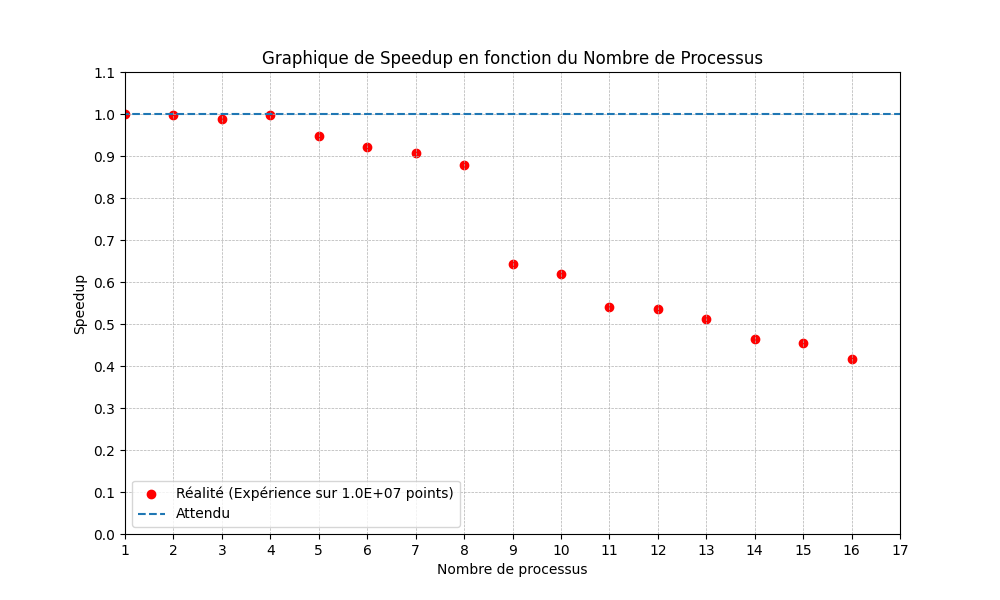

et toujours un poste en G26, voici une expérience sur scalabilité forte : 
| Erreur             | Ntotal    | Nprocessus | Temps(ms) |
|--------------------|----------|------------|-----------|
| 8.817616423835061E-5  | 100000000 | 1          | 3060      |
| 7.175137411128947E-5  | 100000000 | 2          | 1553      |
| 4.374418499155864E-5  | 100000000 | 4          | 800       |
| 1.1437078253809122E-4 | 100000000 | 8          | 425       |
| 5.0386414550711726E-5 | 100000000 | 16         | 486       |

et le speedup donne ça : 
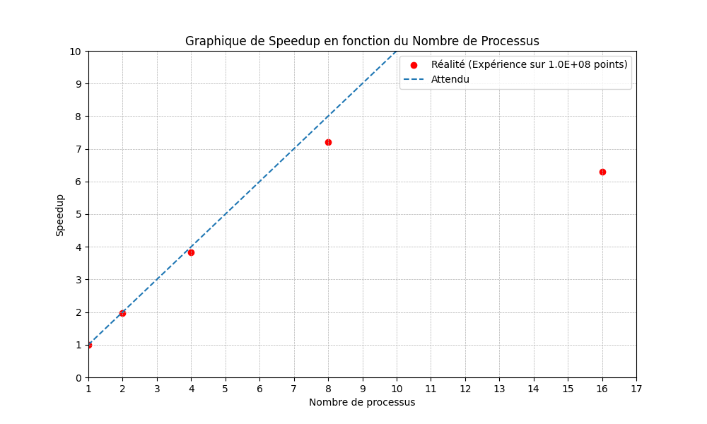

On peut donc affirmer que l'implémentation de la méthode de monte carlo avec les sockets n'est pas utile sur un seule poste, en fait elle perd son intéret principale : la mémoire distribuée. 

En effet l'intérêt de la communication des sockets sont de pouvoir faire communiquer plusieurs machines entre elles, donc d'utiliser les ressources de plusieurs machines simultanément.
### Une expérience idéale

Afin de se rapprocher le plus possible de la courbe idéale (constante pour une scalabilité faible et linéaire pour une scalabilité forte) on pourrait profiter au maximum des capacités des postes de la G26 avec : 
* 8 workers par postes (car ils ont 8 coeurs physique non hyperthreadé)
* 1 master sur un des PC qui va communiquer à chacun des postes

Donc pour 20 postes on va avoir 160 workers simultané. Mais pour l'instant cette expérience n'a pas encore été réalisée 