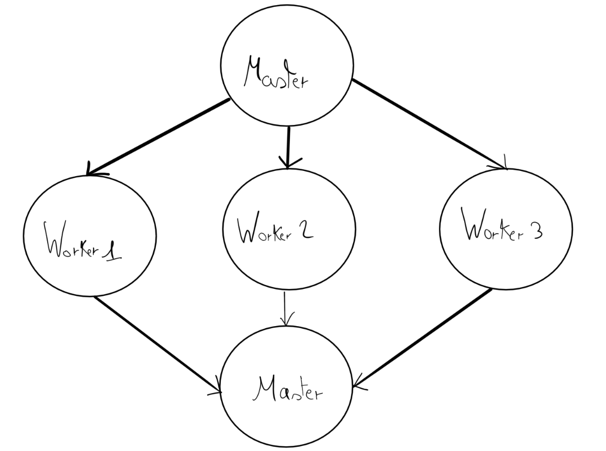
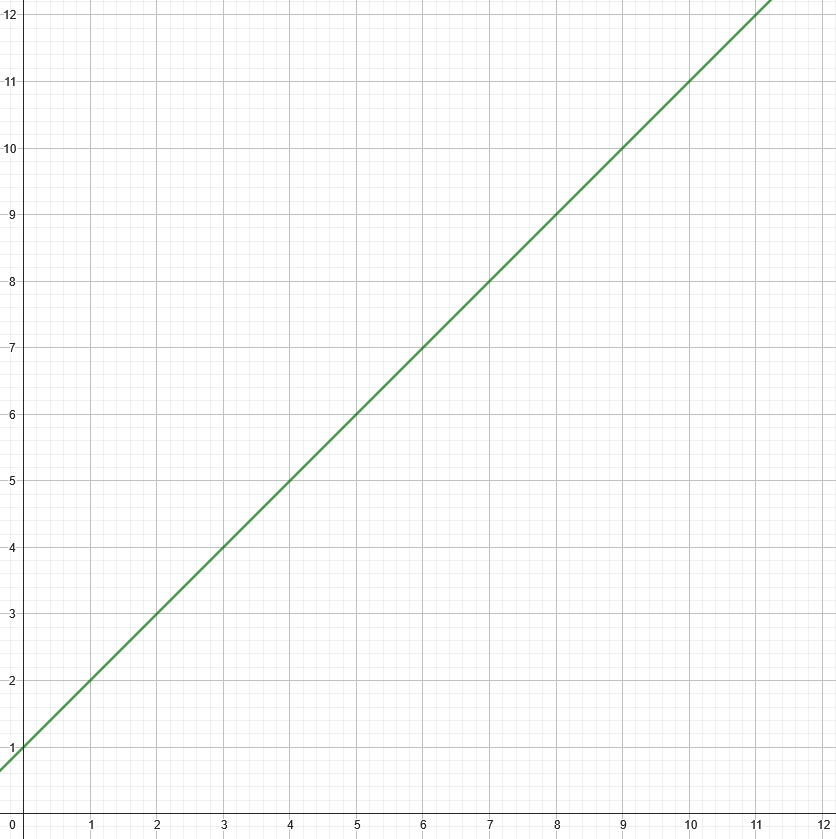
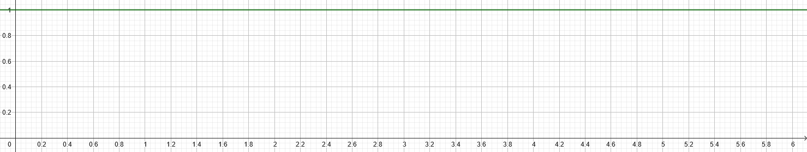

# Compte rendu Monte Carlo

## La méthode de Monte Carlo, c'est quoi ?

La méthode de Monte Carlo c'est une méthode d'approximation de $\pi$ grâce à un grand nombre de simulation
aléatoires. Concrètement, Afin d'approximer $\pi$ on va effectuer des lancers aléatoire sur un quart de disque
(disque de rayon $r = 1$) et pour chacun des lancers on va évaluer sa distance depuis le centre. Pour ça
on utilise la formule suivante :

$d = \sqrt{x^2 + y^2} = x^2 + y^2$

étant donné qu'on a un rayon $r = 1$ il est inutile de faire les puissances et les racines carrées.
Sur $n$ on va approximer $\pi$ en faisant $\frac{nCible}{nTotal}$ avec $nCible$ le nombre de points
avec une distance $d \le 1$.


## Estimation de la probabilité qu'un lancé $X_p$ soit dans le quart de disque

A_1/4 et A_C à définir

$p = \frac{A_{\frac{1}4D}}{A_C} \Leftrightarrow p(X_p | d \le r)$

$p = \frac{\frac{\pi r^2}4}{r^2}$

$p = \frac{\pi}4$

on peut donc approximer que :

$p \approx \frac{nCible}{nTotal} = \frac{\pi}4 \approx \frac{nCible}{nTotal}$

$p = \pi \approx 4 \frac{nCible}{nTotal}$

## Implémentation de la méthode de Monte Carlo

Afin d'illustrer une implémentation possible de cette méthode, j'ai
réalisé un pseudo-code en python :
```java
int n_total = 100000;
int n_cible = 0;
for (int i = 0; i <= n_total; i++) {
    double x = Math.random();
    double y = Math.random();
    double d = Math.pow(x, 2) + Math.pow(y, 2);
    if (d <= 1) {
        n_cible ++;
    }
}
double pi = 4 * (n_cible / n_total);
```
ici dans ce code, la ressource critique est `n_cible` étant donné qu'elle est
partagée par chaque itération du programme, c'est donc un programme parallèlisable mais
mais il faudrait gérer l'accès à cette ressource (comme par exemple en utilisant un moniteur ou une sémaphore) 
dans le cas ou nous faisons des itérations parallèles.

Une autre implémentation de ce programme est possible avec le paradigme Master/Worker.

### Le Master / Worker

Le paradigme Master / Worker c'est : 
* Des workers qui ont chacun une tâche attitrée, dans notre cas c'est $n$ lancés aléatoires
* Un master qui attitre des tâches aux workers et qui traite le résultat de leur travail. Dans notre cas, le master
va s'occuper du calcul `4* (n_cible /n_total)`

Voici un schéma explicatif :


On aura donc $n$ processus worker indépendant, ils vont simultanément calculer $\frac{nTotal}n$ 
tirage aléatoire chacun. Et une fois que chacun des workers a fini sa tâche individuelle, le master va estimer $pi$.
Afin d'évaluer l'efficacité de la parallélisation d'un programme, il existe une méthode, c'est le speedup.
## Le speedup, c'est quoi ?

Un speedup c'est ça :

$S_p=\frac{T_1}{T_p}$

Un Speedup $S_p$ pour $p$ processus. Dans la formule $T_1$ est le temps d'exécution du programme pour $1$ 
processus, et $T_p$ est le temps d'exécution pour $p$ processus.

### Ça sert à quoi ?

Comme dit un peu plus haut ça sert à évaluer l'efficacité de la parallélisation d'un programme. Un speedup de $2$
ça veut dire que le programme va deux fois plus vite que si on l'exécutait avec un seul processus.
mais concrètement 
il y a deux manières de mesurer un speedup.

#### <u>Scalabilité forte</u>

La scalabilité forte consiste à augmenter le nombre de processus à chaque expérience
tout en gardant la même charge, dans ce cas on espère dans le meilleur des cas une évolution du speedup linéaire


#### <u>Scalabilité faible</u> 

La scalabilité faible c'est le fait d'augmenter la charge proportionnellement au nombre de processus. Dans le meilleur
des cas on espère un speedup constant


## L'importance de la configuration et l'environnement pour l'évaluation d'un speedup

Il est très important avant d'effectuer des tests sur le programme ciblé car le processeur a un impact majeur sur la
performance du programme, sur un processeur à 8 coeur on peut remarquer une baisse de performance en utilisant
9 processus sur un programme. La fréquence du processeur a aussi un impact sur le temps d'exécution (car cela 
influe sur le nombre de cycle). Enfin l'environnement d'exécution a aussi un impact sur les performances du programme
et peut influencer sur le résultat.

Voici ma configuration personnelle sur laquelle j'ai effectué tous les tests :

| Composant  | Détails                               |
|------------|---------------------------------------|
| RAM        | 16 GB                                 |
| Processeur | Intel Core i5-13420H (4.60GHz)        
| Coeurs     | 8 coeurs physique et 6 coeurs logique |
| Cache L1   | 704 KB                                |
| Cache L2   | 8 MB                                  |
| Cache L3   | 12 MB                                 |

Voici une machine de l'IUT (en G26) sur laquelle j'ai aussi effectué tous les tests :

| Composant  | Détails                       |
|------------|-------------------------------|
| RAM        | 32 GB                         |
| Processeur | Intel Core i7-9700 (3.00 GHz) |
| Coeurs     | 8 coeurs physique             |
| Cache L1   | 512 KB                        |
| Cache L2   | 2 MB                          |
| Cache L3   | 12 MB                         |


## Evaluation des speedup de différentes implémentation de la méthode de Monte Carlo


