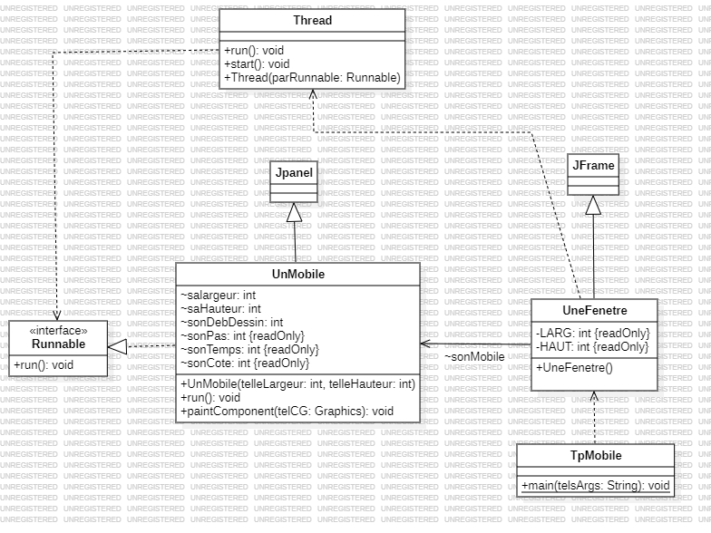
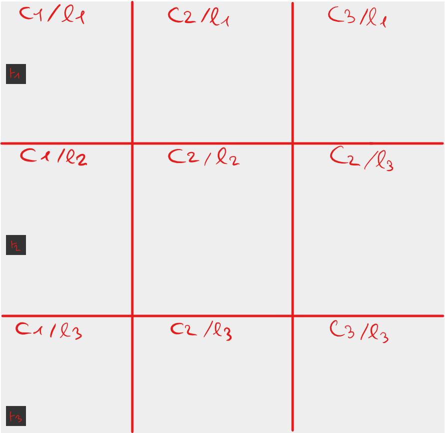
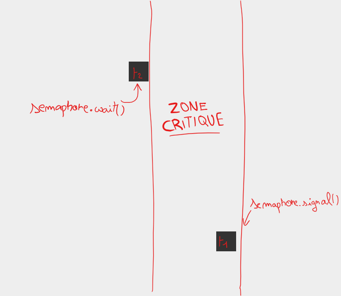
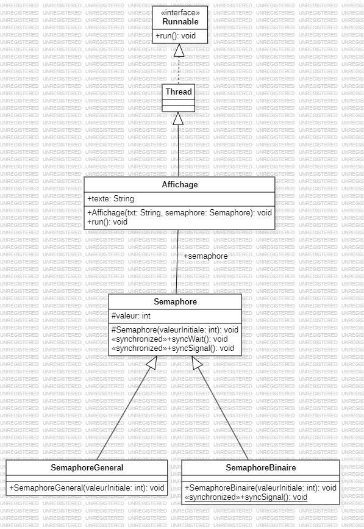
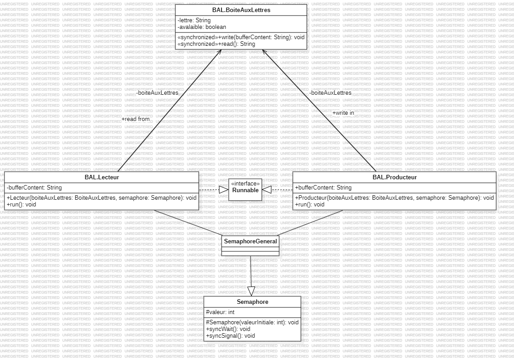
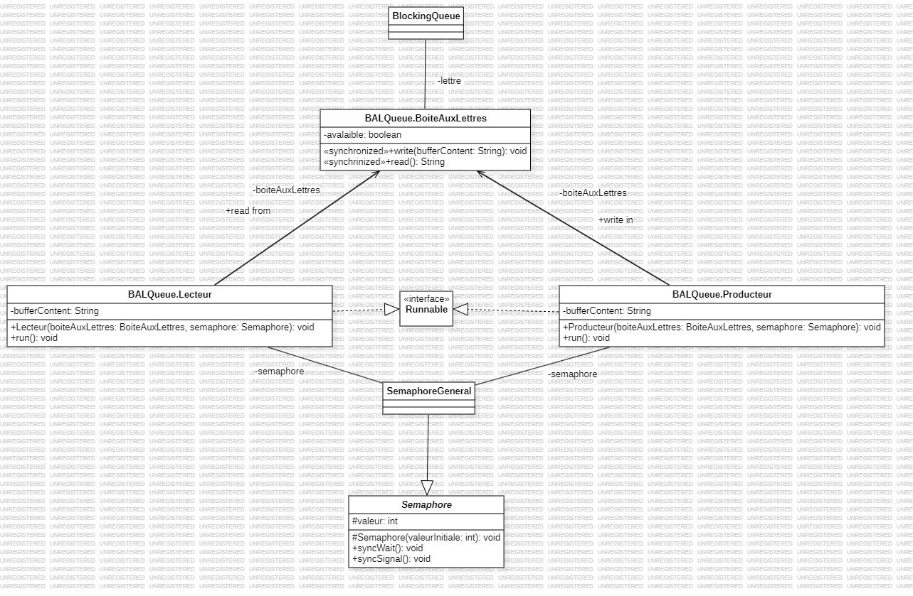
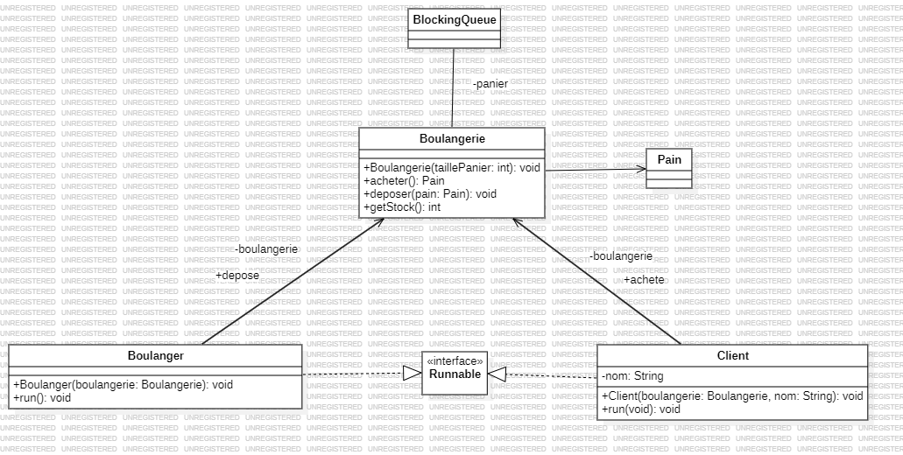

 # <center> Programmation avancée !
CHOISY<br>
Alexis<br>
INF3-FA

Ce document répertorie le contenu des trois TP :

* [Aller au TP1](#tp1)
* [Aller au TP2](#tp2)
* [Aller au TP3](#tp3)

## <a id="tp1">TP n°1 - Le mobile</a> 

### <u>Introduction</u>

Dans ce TP est abordé le principe d'un thread, l'interface `Runnable` ainsi que sa methode `run()`, le principe de sémaphore et de vérrou MUTEX dans le cadre d'une application graphique qui aide à visualiser ces principes. 

***

### <u>Contexte</u>

On a une application qui affiche des mobiles qui se déplacent de gauche à droite, chaque mobile représente un thread. Voici le graphe UML qui représente le code Java de l'application.


Dans la classe `UnMobile.java` on va définir le comportement d'un mobile dans l'application. Puis dans
la classe `UneFenetre.java` on va exécuter le thread correspondant à ce mobile. Tandis que `TpMobile.java` fait office de main.
```java
class UneFenetre extends JFrame 
{
    UnMobile sonMobile;
    private final int LARG=800, HAUT=250;
    
    public UneFenetre()
    {
        super("le Mobile");
        setLayout (new GridLayout(3, 3));

        sonMobile = new UnMobile(LARG, HAUT);
        add(sonMobile);
        Thread thread1 = new Thread(sonMobile);
        thread1.start(); // Exécution du thread
        setSize(LARG, HAUT);
        setVisible(true);
    }

}
```
Afin de faire en sorte que le mobile reparte en sens inverse lorsqu'il atteint une extrémité de la fenêtre j'ai fait 6 boucles for, chacune pour une situation différente dans la methode run de la classe `UnMobile.java`.
```java
    @Override
    public void run() {
        for (sonDebutDessin = 0; sonDebutDessin * 3 < saLargeur - sonPas; sonDebutDessin += sonPas) {
            repaint();
            try {
                Thread.sleep(sonTemps);
            } catch (InterruptedException telleExcp) {
                telleExcp.printStackTrace();
            }
        }
        for (sonDebutDessin = saLargeur / 3; (3 * sonDebutDessin / 2) < saLargeur - sonPas; sonDebutDessin += sonPas) {
            repaint();
            try {
                Thread.sleep(sonTemps);
            } catch (InterruptedException telleExcp) {
                telleExcp.printStackTrace();
            }
        }
        for (sonDebutDessin = 2 * saLargeur / 3; sonDebutDessin < saLargeur - sonPas; sonDebutDessin += sonPas) {
            repaint();
            try {
                Thread.sleep(sonTemps);
            } catch (InterruptedException telleExcp) {
                telleExcp.printStackTrace();
            }
        }
        for (sonDebutDessin = saLargeur; sonDebutDessin > (saLargeur / 3) * 2; sonDebutDessin -= sonPas) {
            repaint();
            try {
                Thread.sleep(sonTemps);
            } catch (InterruptedException telleExcp) {
                telleExcp.printStackTrace();
            }
        }
        for (sonDebutDessin = (saLargeur / 3) * 2; sonDebutDessin > saLargeur / 3; sonDebutDessin -= sonPas) {
            repaint();
            try {
                Thread.sleep(sonTemps);
            } catch (InterruptedException telleExcp) {
                telleExcp.printStackTrace();
            }
        }
        for (sonDebutDessin = saLargeur / 3; sonDebutDessin > sonPas; sonDebutDessin -= sonPas) {
            repaint();
            try {
                Thread.sleep(sonTemps);
            } catch (InterruptedException telleExcp) {
                telleExcp.printStackTrace();
            }
        }
    }
```

### <u>L'interface `Runnable`</u>

La methode `run()` abstraite de l'interface `Runnable` qui est destinée à être exécuté par un `Thread` et définit le comportement qu'aura le thread tout au long de sa vie.

### <u>Le MUTEX</u>

Par la suite nous j'ai ajouté un deuxième mobile, donc un deuxième thread. Mais le problème c'est que dans certains cas on ne veut pas accéder à la même ressource
en même temps, c'est là qu'intervient le verrou MUTEX (<strong style="color:red;">MUT</strong>ual <strong style="color:red;">EX</strong>clusion). Plus précisément ici j'ai utilisé une Sémaphore, du moins une implémentation (donnée par le prof !) afin d'en comprendre le fonctionnement. 
```java
package org.example;

public abstract class Semaphore {

    protected int valeur = 0;

    protected Semaphore(int valeurInitiale){
    valeur = valeurInitiale>0 ? valeurInitiale:0;
    }

    public synchronized void syncWait(){
    try {
        while(valeur<=0){
        wait();
        }
        valeur--;
    } catch(InterruptedException e){}
    }

    public synchronized void syncSignal(){
        valeur++;
        if(valeur > 0) {
            notifyAll();
        }
    }
}
```

On a donc notre application qui est scindée en trois colonnes (et ici 3 mobiles).

La colonne 2 (qui est la section critique) n'accepte qu'un seul thread, si un thread pénètre cette colonne, les autres threads seront mis dans l'état `sleep` par la sémaphore grâce à l'instruction `wait` jusqu'à ce que le thread soit sorti de la section critique, dès lors la sémaphore va faire un `signal` qui va faire rentrer un autre thread dans la section critique et le cycle se répète.



Ce qui se passe concrétement, c'est qu'à chaque entrée de boucle (à partir de la deuxième colonne) on va faire appel à la méthode `syncWait()` sémaphore (sémaphore donnée en paramètre du constructeur) qui va stopper tout les mobiles à l'entrée de la section critique, puis quand le mobile sort de celle-ci on va faire appel à la méthode `syncSignal()` toujours de la même sémaphore.
```java
    @Override
    public void run() {
        for (sonDebutDessin = 0; sonDebutDessin * 3 < saLargeur - sonPas; sonDebutDessin += sonPas) {
            /* MÊME CODE QU'AVANT */
        }
        semaphore.syncWait(); // Le mobile entre dans la section critique en avancant
        for (sonDebutDessin = saLargeur / 3; (3 * sonDebutDessin / 2) < saLargeur - sonPas; sonDebutDessin += sonPas) {
            /* MÊME CODE QU'AVANT */
        }
        semaphore.syncSignal(); // Le mobile sort de la section critique en avancant
        for (sonDebutDessin = 2 * saLargeur / 3; sonDebutDessin < saLargeur - sonPas; sonDebutDessin += sonPas) {
            /* MÊME CODE QU'AVANT */
        }
        for (sonDebutDessin = saLargeur; sonDebutDessin > (saLargeur / 3) * 2; sonDebutDessin -= sonPas) {
            /* MÊME CODE QU'AVANT */
        }
        semaphore.syncWait(); // Le mobile entre dans la section critique en reculant
            /* MÊME CODE QU'AVANT */
        }
        semaphore.syncSignal(); // Le mobile sort de section critique en reculant
        for (sonDebutDessin = saLargeur / 3; sonDebutDessin > sonPas; sonDebutDessin -= sonPas) {
            /* MÊME CODE QU'AVANT */
        }
    }
```

## <a id="tp2">TP n°2 - Semaphore</a>

### <u>Introduction</u>
Dans ce TP le principe de semaphore et l'instruction synchronized sont abordés.

***
### <u>Contexte</u>
Le problème ici est que, deux threads vont vouloir accéder à une même tâche en même temps (qui est de d'imprimer une suite de lettre) mais leurs tâches vont s'entremêler, il faut donc tout d'abord déterminer dans le code qu'est-ce que la section critique. On a un code de la sorte dans la classe `Affichage.java`
```java
public class Affichage extends Thread {
    String texte;

    public Affichage(String txt, Semaphore semaphore) {
        texte = txt;
    }

    public void run() {
        for (int i = 0; i < texte.length(); i++) {
            System.out.print(texte.charAt(i));
            try {
                sleep(100);
            } catch (InterruptedException e) {
                System.out.println(e);
            }
        }
    }
}
```

Voici la conception du code UML du code

### <u>La section critique</u>

La section critique ici est la boucle for, car c'est l'action à ne pas exécuter en même temps par les threads, une fois qu'un thread a fini son print il laisTP2se place à un autre thread pour imprimer. Il y a plusieurs manières de faire en Java pour que les tâches des threads n'entrent pas en conflit :

* Avec l'utilisation de `synchronized`. Quand on utilise cette instruction, Java utilise de manière interne un moniteur, le moniteur va gérer les accès à la donnée, mais ce qui est le plus important c'est que l'instruction `synchronized` va mettre un verrou MUTEX sur la section critique qui peut être une méthode, ou un bloc de code (ici c'est un bloc de code).
```java
public void run() {
    synchronized (this) {
        for (int i = 0; i < texte.length(); i++) {
            System.out.print(texte.charAt(i));
            try {
                sleep(100);
            } catch (InterruptedException e) {
                System.out.println(e);
            }
        }
    }
}
```
* Avec l'utilisation d'un Sémaphore qui va aussi gérer les accès à la section critique. Voici l'implémentation de la classe `Sémaphore.java`.
```java
public abstract class Semaphore {

    protected int valeur = 0;

    protected Semaphore(int valeurInitiale) {
        valeur = valeurInitiale > 0 ? valeurInitiale : 0;
    }

    public synchronized void syncWait() {
        try {
            while (valeur <= 0) {
                wait();
            }
            valeur--;
        } catch (InterruptedException e) {
        }
    }

    public synchronized void syncSignal() {
        valeur++;
        if (valeur > 0) {
            notifyAll();
        }
    }
}

``` 
avec `this.valeur` qui correspond au nombre de threads qui peuvent accéder à la section ou ressource critique, quand on fait appel à `syncWait()` qui va décrémenter `this.valeur` à chaque thread qui entre dans la section critique ou agit sur la ressource critique et si `this.valeur` est inférieur ou égal à 0 alors la sémaphore va faire attendre le thread. Quand un thread sort de la section critique on fait appel à `syncSignal()` qui va incrémenter `this.valeur` et faire appel à `notifyAll()` qui réveille tout les threads si la ressource ou section critique est disponible.<br>
Plus précisément j'utilise une `SemaphoreBinaire.java`, c'est une implémentation différente de la classe abstraite `Semahpore.java` qui limite l'accès à la ressource ou la section critique à un seul thread
```java
public final class SemaphoreBinaire extends Semaphore {
    public SemaphoreBinaire(int valeurInitiale) {
        super((valeurInitiale != 0) ? 1 : 0);
        System.out.println("J'entre dans la section critique");
    }

    public final synchronized void syncSignal() {
        super.syncSignal();
        if (valeur > 1)
            valeur = 1;
        System.out.println("Je sors de la section critique");
    }
}

```
Voici comment ça rend dans la classe affichage, on restreint l'accès à la boucle for quand un thread commence à imprimer ses caractères et on libère l'accès quand il a finit d'imprimer.
```java
public class Affichage extends Thread {
    String texte;
    Semaphore semaphore;

    public Affichage(String txt, Semaphore semaphore) {
        texte = txt;
        this.semaphore = semaphore;
    }

    public void run() {
        semaphore.syncWait();
        for (int i = 0; i < texte.length(); i++) {
            System.out.print(texte.charAt(i));
            try {
                sleep(100);
            } catch (InterruptedException e) {
                System.out.println(e);
            }
        }
        semaphore.syncSignal();
    }
}
```

## <a id="tp3">TP n°3 - Boulangerie et Boîte aux lettres</a>

### <u>Introduction</u>

Dans ce TP est abordé le design pattern de producteur-consommateur avec comme exemple une boîte aux lettres et une boulangerie

***

### <u>BAL</u>

La boîte aux lettres se base sur le design pattern de producteur-consommateur où on a une classe `Producteur.java` qui va mettre à disposition (dans cet exemple) une lettre dans la boîte aux lettres qui est elle représentée par une classe `BoiteAuxLettres.java` et une classe `Lecteur.java` va retirer et lire la lettre de celle-ci.

Ici dans mon implémentation de la BAL j'ai une lettre représentée par un `String`, les deux `Producteur.java` et `Lecteur.java` on un buffer pour stocker respectivement la lettre à déposer et la lettre à lire stocké sur le moniteur `BoiteAuxLettres` qui a un champs pour la lettre stockée et l'autre pour savoir si celle-ci est en ce moment accessible. J'ai aussi fait appel à une Semaphore afin de pouvoir écrire des entrées par clavier avec `Scanner`, concrètement le Thread qui correspond au lecteur va dormir lorsque le producteur va écrire et le Thread qui correspond au producteur va dormir quand le lecteur lit
```java
    @Override
    public void run() {

        while (true)
        {
            try
            {
                Thread.sleep(1000);
                semaphore.syncWait();
                Scanner scanner = new Scanner(System.in);

                System.out.print("Entrez une lettre : ");
                String bufferContent = scanner.next();
                boiteAuxLettres.write(bufferContent);
                if (!Objects.equals(boiteAuxLettres.read(), "")) {
                    System.out.println("Producteur: J'écris '" + bufferContent + "' dans la boîte aux lettres");
                }
                else
                {
                    System.out.println("Producteur: La boîte aux lettres est pleines");
                }
                semaphore.syncSignal();
            }
            catch (InterruptedException e)
            {
                throw new RuntimeException(e);
            }

        }
    }
```
```java
    @Override
    public void run() {
        while (true) {
            try {
                Thread.sleep(1000);
                semaphore.syncWait();
                bufferContent = boiteAuxLettres.read();
                if (Objects.equals(bufferContent.toLowerCase(), "q"))
                {
                    System.out.println("Lecteur: Ok, je m'arrête");
                    exit(0);
                }
                else if (!bufferContent.equals(""))
                {
                    System.out.println("Lecteur: Je lis '" + bufferContent + "'");
                }
                else
                {
                    System.out.println("Lecteur: Il n'y a rien dans la boîte aux lettres");
                }
                semaphore.syncSignal();
            } catch (InterruptedException e) {
                throw new RuntimeException(e);
            }
        }
    }
```

### <u>BAL - Queue</u>
C'est sensiblement la même chose à part que la BAL sauf 
qu'on utilise une `BlockingQueue` qui est elle même déjà
l'implémentation d'un moniteur. 

On a la methode `write()` qui fait appel à la methode `put()` de `BlockingQueue` qui est elle même une implémentation d'un write dans le moniteur `BlockingQueue` et c'est la même chose pour la methode `take()` qui est appelé par la methode `read()`.
```java
public class BoiteAuxLettres {
    private BlockingQueue<String> lettre;
    private boolean avalaible;

    public BoiteAuxLettres() {
        lettre =  new ArrayBlockingQueue<>(1);
        this.avalaible = true;
    }

    synchronized public void write(String bufferContent) throws InterruptedException {
        if (avalaible) {
            avalaible = false;
            lettre.put(bufferContent);
            avalaible = true;
        }
    }

    synchronized public String read() throws InterruptedException {
        if (lettre.size() == 0)
        {
            return "";
        }
        return lettre.take();
    }
}
```
Ici, à la place d'avoir un `String`, on a une `BlockingQueue`, ce qui est plus approprié au contexte.

### <u>Boulangerie</u>

La boulangerie utilise le même design pattern que la BAL sauf que l'exemple est différent, dans cet exemple on a des `Client` (les consommateurs) et des `Boulanger` (les producteurs), les boulangers mettent à disposition du pain dans la `Boulangerie` dans cet exemple la boulangerie a pour champ une `ArrayBlockingQueue` d'une taille spécifié dans le constructeur (20 dans l'instanciation de la boulangerie dans le main). L'exemple de la boulangerie implémente le principe de pilule empoisonnée représenté par le champ final `PAIN_EMPOISONNE`, c'est un pain qui, si il est mangé par un thread, l'interompt. Une interruption est une indication à un thread qu’il devrait arrêter ce qu’il fait et faire autre chose à la place, sauf que dans notre cas il ne fait rien donc il meurt.
