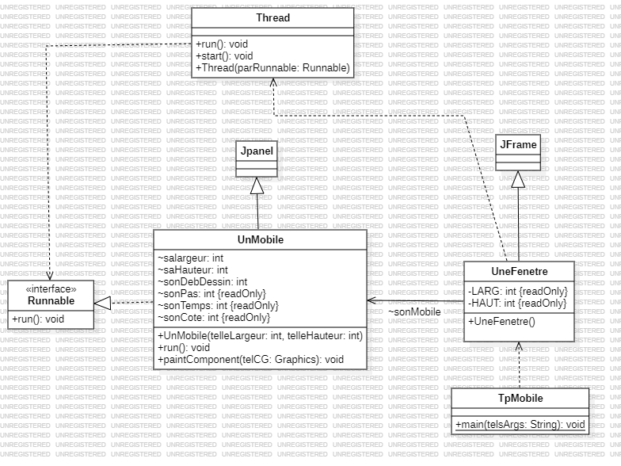
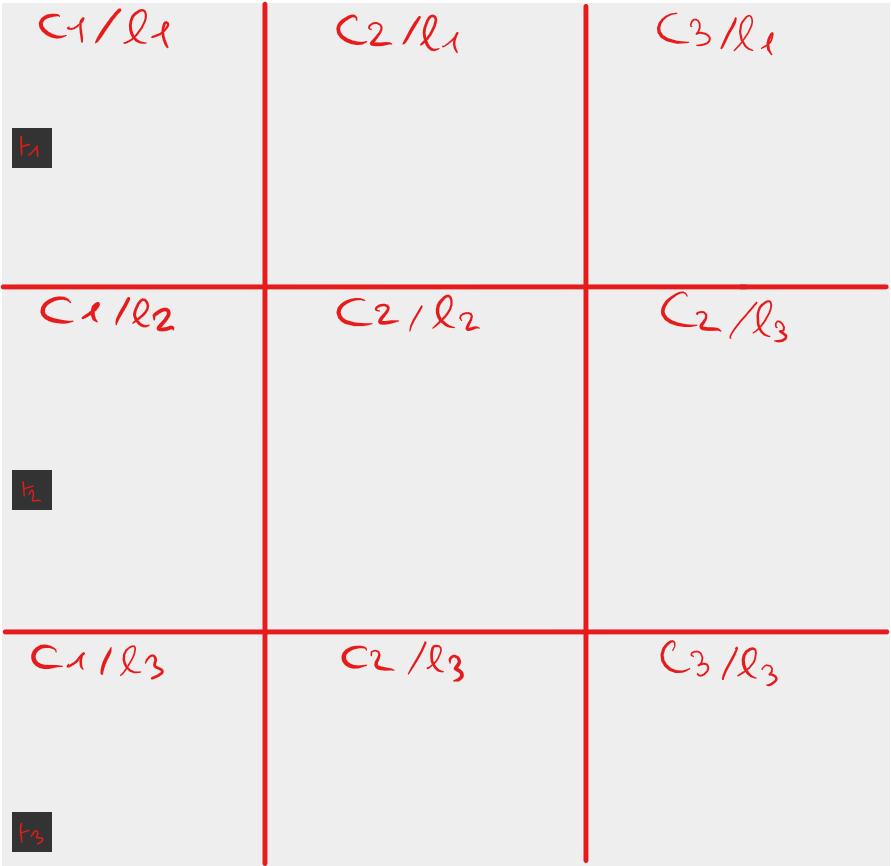
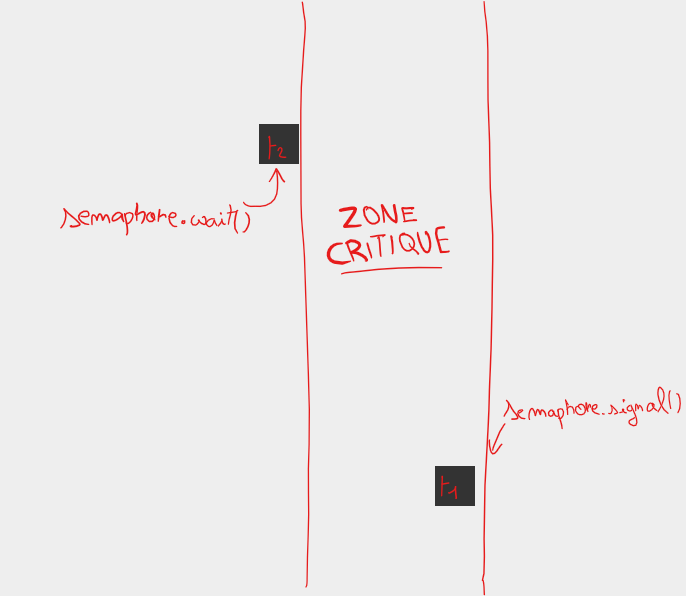

# <center>TP n°1 - Le mobile</center> 

CHOISY<br>
Alexis<br>
INF3-FA

### <u>Introduction</u>

Dans ce TP est abordé le principe d'un thread, l'interface `Runnable` ainsi que sa methode `run()`, le principe de sémaphore et de vérrou MUTEX dans le cadre d'une application graphique qui aide à visualiser ces principes. 

***

### <u>Contexte</u>

On a une application qui affiche des mobiles qui se déplacent de gauche à droite, chaque mobile représente un thread. Voici le graphe UML qui représente le code Java de l'application.


Dans la classe `UnMobile.java` on va définir le comportement d'un mobile dans l'application. Puis dans
la classe `UneFenetre.java` on va exécuter le thread correspondant à ce mobile. Tandis que `TpMobile.java` fait office de main.
```java
class UneFenetre extends JFrame 
{
    UnMobile sonMobile;
    private final int LARG=800, HAUT=250;
    
    public UneFenetre()
    {
        super("le Mobile");
        setLayout (new GridLayout(3, 3));

        sonMobile = new UnMobile(LARG, HAUT);
        add(sonMobile);
        Thread thread1 = new Thread(sonMobile);
        thread1.start(); // Exécution du thread
        setSize(LARG, HAUT);
        setVisible(true);
    }

}
```
Afin de faire en sorte que le mobile reparte en sens inverse lorsqu'il atteint une extrémité de la fenêtre j'ai fait 6 boucles for, chacune pour une situation différente dans la methode run de la classe `UnMobile.java`.
```java
    @Override
    public void run() {
        for (sonDebutDessin = 0; sonDebutDessin * 3 < saLargeur - sonPas; sonDebutDessin += sonPas) {
            repaint();
            try {
                Thread.sleep(sonTemps);
            } catch (InterruptedException telleExcp) {
                telleExcp.printStackTrace();
            }
        }
        for (sonDebutDessin = saLargeur / 3; (3 * sonDebutDessin / 2) < saLargeur - sonPas; sonDebutDessin += sonPas) {
            repaint();
            try {
                Thread.sleep(sonTemps);
            } catch (InterruptedException telleExcp) {
                telleExcp.printStackTrace();
            }
        }
        for (sonDebutDessin = 2 * saLargeur / 3; sonDebutDessin < saLargeur - sonPas; sonDebutDessin += sonPas) {
            repaint();
            try {
                Thread.sleep(sonTemps);
            } catch (InterruptedException telleExcp) {
                telleExcp.printStackTrace();
            }
        }
        for (sonDebutDessin = saLargeur; sonDebutDessin > (saLargeur / 3) * 2; sonDebutDessin -= sonPas) {
            repaint();
            try {
                Thread.sleep(sonTemps);
            } catch (InterruptedException telleExcp) {
                telleExcp.printStackTrace();
            }
        }
        for (sonDebutDessin = (saLargeur / 3) * 2; sonDebutDessin > saLargeur / 3; sonDebutDessin -= sonPas) {
            repaint();
            try {
                Thread.sleep(sonTemps);
            } catch (InterruptedException telleExcp) {
                telleExcp.printStackTrace();
            }
        }
        for (sonDebutDessin = saLargeur / 3; sonDebutDessin > sonPas; sonDebutDessin -= sonPas) {
            repaint();
            try {
                Thread.sleep(sonTemps);
            } catch (InterruptedException telleExcp) {
                telleExcp.printStackTrace();
            }
        }
    }
```

### <u>L'interface `Runnable`</u>

La methode `run()` abstraite de l'interface `Runnable` qui est destinée à être exécuté par un `Thread` et définit le comportement qu'aura le thread tout au long de sa vie.

### <u>Le MUTEX</u>

Par la suite nous j'ai ajouté un deuxième mobile, donc un deuxième thread. Mais le problème c'est que dans certains cas on ne veut pas accéder à la même ressource
en même temps, c'est là qu'intervient le verrou MUTEX (<strong style="color:red;">MUT</strong>ual <strong style="color:red;">EX</strong>clusion). Plus précisément ici j'ai utilisé une Sémaphore, du moins une implémentation (donnée par le prof !) afin d'en comprendre le fonctionnement. 
```java
package org.example;

public abstract class Semaphore {

    protected int valeur = 0;

    protected Semaphore(int valeurInitiale){
	valeur = valeurInitiale>0 ? valeurInitiale:0;
    }

    public synchronized void syncWait(){
	try {
	    while(valeur<=0){
		wait();
        }
	    valeur--;
	} catch(InterruptedException e){}
    }

    public synchronized void syncSignal(){
        valeur++;
        if(valeur > 0) {
            notifyAll();
        }
    }
}
```

On a donc notre application qui est scindée en trois colonnes (et ici 3 mobiles).

La colonne 2 (qui est la zone critique) n'accepte qu'un seul thread, si un thread pénètre cette colonne, les autres threads seront mis dans l'état `sleep` par la sémaphore grâce à l'instruction `wait` jusqu'à ce que le thread soit sorti de la zone critique, dès lors la sémaphore va faire un `signal` qui va faire rentrer un autre thread dans la zone critique et le cycle se répète.



Ce qui se passe concrétement, c'est qu'à chaque entrée de boucle (à partir de la deuxième colonne) on va faire appel à la méthode `syncWait()` sémaphore (sémaphore donnée en paramètre du constructeur) qui va stopper tout les mobiles à l'entrée de la zone critique, puis quand le mobile sort de celle-ci on va faire appel à la méthode `syncSignal()` toujours de la même sémaphore.
```java
    @Override
    public void run() {
        for (sonDebutDessin = 0; sonDebutDessin * 3 < saLargeur - sonPas; sonDebutDessin += sonPas) {
            /* MÊME CODE QU'AVANT */
        }
        semaphore.syncWait(); // Le mobile entre dans la zone critique en avancant
        for (sonDebutDessin = saLargeur / 3; (3 * sonDebutDessin / 2) < saLargeur - sonPas; sonDebutDessin += sonPas) {
            /* MÊME CODE QU'AVANT */
        }
        semaphore.syncSignal(); // Le mobile sort de la zone critique en avancant
        for (sonDebutDessin = 2 * saLargeur / 3; sonDebutDessin < saLargeur - sonPas; sonDebutDessin += sonPas) {
            /* MÊME CODE QU'AVANT */
        }
        for (sonDebutDessin = saLargeur; sonDebutDessin > (saLargeur / 3) * 2; sonDebutDessin -= sonPas) {
            /* MÊME CODE QU'AVANT */
        }
        semaphore.syncWait(); // Le mobile entre dans la zone critique en reculant
        for (sonDebutDessin = (saLargeur / 3) * 2; sonDebutDessin > saLargeur / 3; sonDebutDessin -= sonPas) {
            /* MÊME CODE QU'AVANT */
        }
        semaphore.syncSignal(); // Le mobile sort de zone critique en reculant
        for (sonDebutDessin = saLargeur / 3; sonDebutDessin > sonPas; sonDebutDessin -= sonPas) {
            /* MÊME CODE QU'AVANT */
        }
    }
```