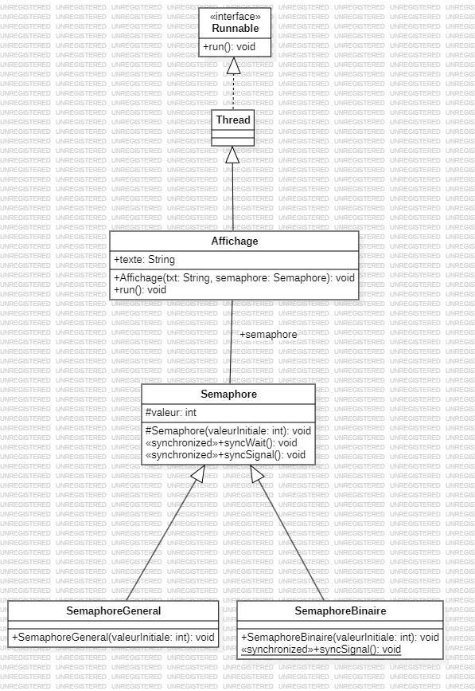

# <center>TP n°2 - Semaphore</center>

CHOISY<br>
Alexis<br>
INF3-FA

### <u>Introduction</u>
Dans ce TP le principe de semaphore et l'instruction synchronized sont abordés.

***
### <u>Contexte</u>
Le problème ici est que, deux threads vont vouloir accéder à une même tâche en même temps (qui est de d'imprimer une suite de lettre) mais leurs tâches vont s'entremêler, il faut donc tout d'abord déterminer dans le code qu'est-ce que la section critique. On a un code de la sorte dans la classe `Affichage.java`
```java
public class Affichage extends Thread {
    String texte;

    public Affichage(String txt, Semaphore semaphore) {
        texte = txt;
    }

    public void run() {
        for (int i = 0; i < texte.length(); i++) {
            System.out.print(texte.charAt(i));
            try {
                sleep(100);
            } catch (InterruptedException e) {
                System.out.println(e);
            }
        }
    }
}
```

Voici la conception du code UML du code

### <u>La section critique</u>

La section critique ici est la boucle for, car c'est l'action à ne pas exécuter en même temps par les threads, une fois qu'un thread a fini son print il laisse place à un autre thread pour imprimer. Il y a plusieurs manières de faire en Java pour que les tâches des threads n'entrent pas en conflit :

* Avec l'utilisation de `synchronized`. Quand on utilise cette instruction, Java utilise de manière interne un moniteur, le moniteur va gérer les accès à la donnée, mais ce qui est le plus important c'est que l'instruction `synchronized` va mettre un verrou MUTEX sur la section critique qui peut être une méthode, ou un bloc de code (ici c'est un bloc de code).
```java
public void run() {
    synchronized (this) {
        for (int i = 0; i < texte.length(); i++) {
            System.out.print(texte.charAt(i));
            try {
                sleep(100);
            } catch (InterruptedException e) {
                System.out.println(e);
            }
        }
    }
}
```
* Avec l'utilisation d'un Sémaphore qui va aussi gérer les accès à la section critique. Voici l'implémentation de la classe `Sémaphore.java`.
```java
public abstract class Semaphore {

    protected int valeur = 0;

    protected Semaphore(int valeurInitiale) {
        valeur = valeurInitiale > 0 ? valeurInitiale : 0;
    }

    public synchronized void syncWait() {
        try {
            while (valeur <= 0) {
                wait();
            }
            valeur--;
        } catch (InterruptedException e) {
        }
    }

    public synchronized void syncSignal() {
        valeur++;
        if (valeur > 0) {
            notifyAll();
        }
    }
}

``` 
avec `this.valeur` qui correspond au nombre de threads qui peuvent accéder à la section ou ressource critique, quand on fait appel à `syncWait()` qui va décrémenter `this.valeur` à chaque thread qui entre dans la section critique ou agit sur la ressource critique et si `this.valeur` est inférieur ou égal à 0 alors la sémaphore va faire attendre le thread. Quand un thread sort de la section critique on fait appel à `syncSignal()` qui va incrémenter `this.valeur` et faire appel à `notifyAll()` qui réveille tout les threads si la ressource ou section critique est disponible.<br>
Plus précisément j'utilise une `SemaphoreBinaire.java`, c'est une implémentation différente de la classe abstraite `Semahpore.java` qui limite l'accès à la ressource ou la section critique à un seul thread
```java
public final class SemaphoreBinaire extends Semaphore {
    public SemaphoreBinaire(int valeurInitiale) {
        super((valeurInitiale != 0) ? 1 : 0);
        System.out.println("J'entre dans la section critique");
    }

    public final synchronized void syncSignal() {
        super.syncSignal();
        if (valeur > 1)
            valeur = 1;
        System.out.println("Je sors de la section critique");
    }
}

```
Voici comment ça rend dans la classe affichage, on restreint l'accès à la boucle for quand un thread commence à imprimer ses caractères et on libère l'accès quand il a finit d'imprimer.
```java
public class Affichage extends Thread {
	String texte;
	Semaphore semaphore;

	public Affichage(String txt, Semaphore semaphore) {
		texte = txt;
		this.semaphore = semaphore;
	}

	public void run() {
		semaphore.syncWait();
		for (int i = 0; i < texte.length(); i++) {
			System.out.print(texte.charAt(i));
			try {
				sleep(100);
			} catch (InterruptedException e) {
				System.out.println(e);
			}
		}
		semaphore.syncSignal();
	}
}
```