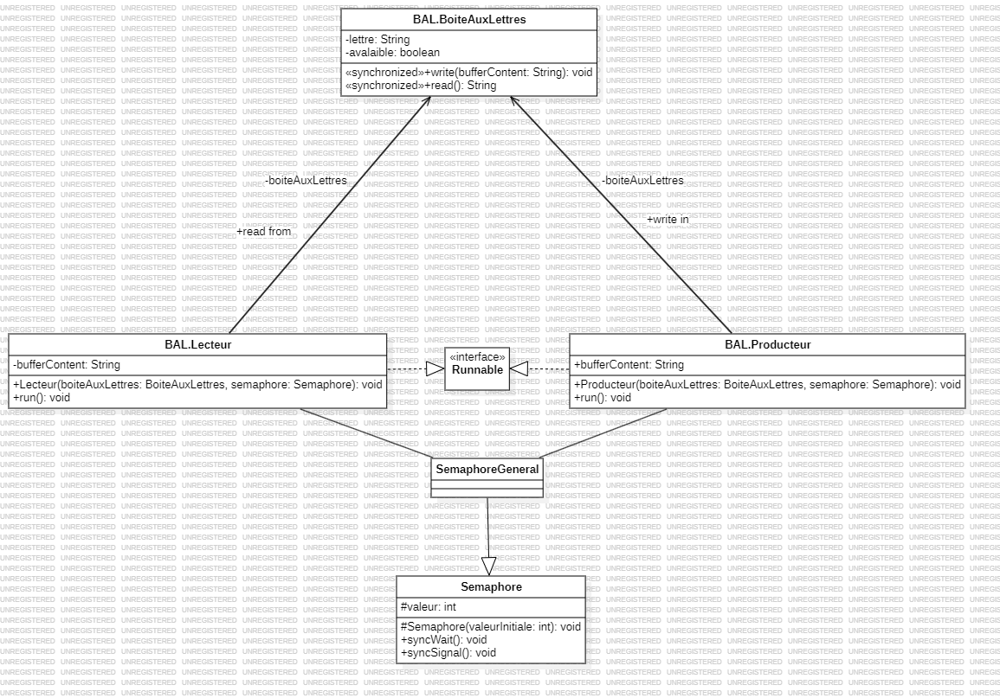
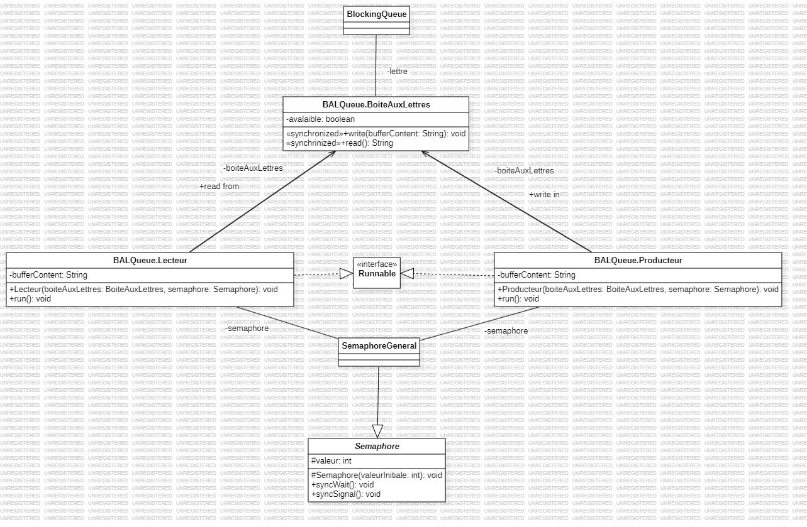
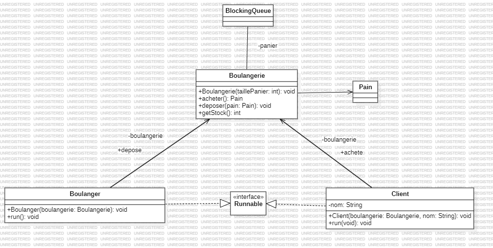

# <center>TP n°3 - Boulangerie et Boîte aux lettres</center>

### <u>Introduction</u>

Dans ce TP est abordé le design pattern de producteur-consomateur avec comme exemple une boîte aux lettres et une boulangerie

***

### <u>BAL</u>

La boîte aux lettres se base sur le design pattern de producteur-consomateur où on a une classe `Producteur.java` qui va mettre à disposition (dans cet exemple) une lettre dans la boîte au lettre qui est elle représenté par une classe `BoiteAuxLettres.java` et une class `Lecteur.java` va retirer et lire la lettre de celle-ci.

Ici dans mon implémentation de la BAL j'ai une lettre représentée par un `String`, les deux `Producteur.java` et `Lecteur.java` on un buffer pour stocker respectivement la lettre à déposer et la lettre à lire. J'ai aussi fait appel à une Semaphore afin de pouvoir écrire des entrées par clavier avec `Scanner`, concrètement le Thread qui correspond au lecteur va dormir lorsque le producteur va écrire et le Thread qui correspond au producteur va dormir quand le lecteur lit
```java
    @Override
    public void run() {

        while (true)
        {
            try
            {
                Thread.sleep(1000);
                semaphore.syncWait();
                Scanner scanner = new Scanner(System.in);

                System.out.print("Entrez une lettre : ");
                String bufferContent = scanner.next();
                boiteAuxLettres.write(bufferContent);
                if (!Objects.equals(boiteAuxLettres.read(), "")) {
                    System.out.println("Producteur: J'écris '" + bufferContent + "' dans la boîte aux lettres");
                }
                else
                {
                    System.out.println("Producteur: La boîte aux lettres est pleines");
                }
                semaphore.syncSignal();
            }
            catch (InterruptedException e)
            {
                throw new RuntimeException(e);
            }

        }
    }
```
```java
    @Override
    public void run() {
        while (true) {
            try {
                Thread.sleep(1000);
                semaphore.syncWait();
                bufferContent = boiteAuxLettres.read();
                if (Objects.equals(bufferContent.toLowerCase(), "q"))
                {
                    System.out.println("Lecteur: Ok, je m'arrête");
                    exit(0);
                }
                else if (!bufferContent.equals(""))
                {
                    System.out.println("Lecteur: Je lis '" + bufferContent + "'");
                }
                else
                {
                    System.out.println("Lecteur: Il n'y a rien dans la boîte aux lettres");
                }
                semaphore.syncSignal();
            } catch (InterruptedException e) {
                throw new RuntimeException(e);
            }
        }
    }
```

### <u>BAL - Queue</u>
C'est sensiblement la même chose appart que la BAL sauf qu'on utilise une `BlockingQueue` de un seul élément, à la place d'avoir un `String`, ce qui est plus approprié au contexte.


### <u>Boulangerie</u>


